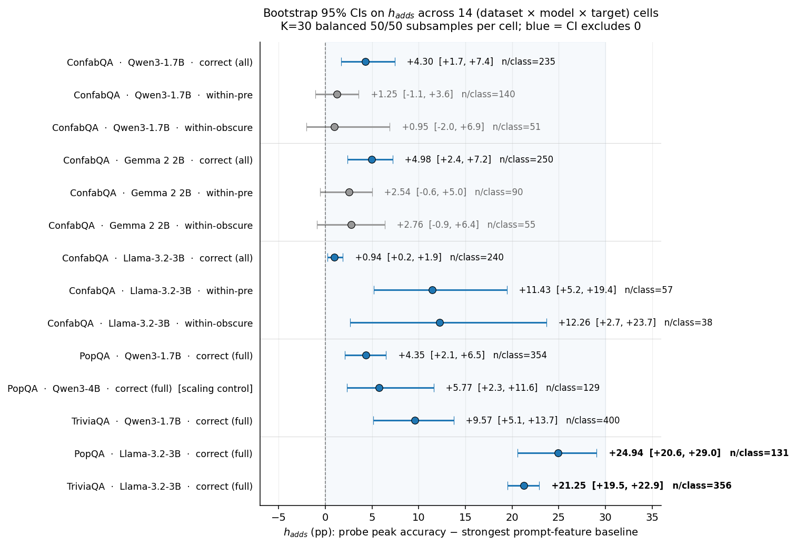

# ConfabQA: Hidden-State Refusal and Correctness Signals in Three Small Language Models

A disconfounded probing benchmark, multi-model multi-dataset bootstrap, refusal-channel attribution, and sparse-autoencoder decomposition for small instruction-tuned LMs (Qwen3-1.7B, Gemma 2 2B, Llama 3.2 3B).

   

**Paper:** [`paper_confabqa.pdf`](paper_confabqa.pdf)
**Author:** Vladimir Kazei (Independent Research)
**License:** MIT (code), CC BY 4.0 (benchmark and paper)

---

## TL;DR

When a small language model gives a confidently wrong answer — a *confabulation* — does its hidden state at the moment of commitment already encode the warning sign? Linear probes routinely reach 80–90% accuracy at predicting correctness, but a logistic regression trained only on the question text often reaches comparable accuracy on the same labels. A hidden-state probe that does not beat the prompt-text baseline has extracted no model-internal information. ConfabQA fixes the first problem in the *dataset* (an obscure pre-cutoff category that breaks the cutoff/correctness confound) and the second in the *protocol*: every probe, on every model and dataset, is scored as its margin over the strongest of four prompt-feature baselines.

This paper applies that protocol systematically across three instruction-tuned models on three benchmarks, with a $K = 30$ balanced-subsample bootstrap across fourteen `(dataset, model, target)` cells. Four findings:

1. **Cross-model gap is large.** Llama-3.2-3B's hidden state adds +21 to +25 pp over the strongest prompt baseline on PopQA and TriviaQA; Qwen3-1.7B adds +4 to +10 pp on the same data.
2. **Not a parameter-count effect.** A within-family scaling control (Qwen3-1.7B vs. Qwen3-4B on PopQA, same family at 2.4× the parameter count) closes the gap with Qwen3-1.7B by less than 2 pp. The cross-model gap tracks model family / post-training recipe, not size.
3. **Bulk of the signal is genuine correctness self-knowledge, not refusal-channel readout.** Dropping refusals and re-probing correct-vs-wrong on attempted items leaves ~83% of Llama's lead intact. Llama additionally carries an independent linearly-decodable abstention direction.
4. **The recovered direction is a superposition of mechanistic primitives.** A sparse-autoencoder decomposition of the Qwen3-1.7B refusal direction resolves it into a canonical refusal-opener feature, a dormant apology-opener feature, and two post-cutoff content-cue detectors. Adding the opener feature's decoder vector alone causally flips 30/30 wrong-item next-token argmaxes to refusal openers, at the same intervention magnitude as the broader probe direction.



| cell | h_adds (pp) | 95% CI | excludes 0 |
|---|--:|---|:--:|
| PopQA · Llama-3.2-3B | **+24.94** | [+20.57, +29.03] | yes |
| TriviaQA · Llama-3.2-3B | **+21.25** | [+19.52, +22.89] | yes |
| TriviaQA · Qwen3-1.7B | +9.57 | [+5.13, +13.75] | yes |
| PopQA · Qwen3-4B (scaling control) | +5.77 | [+2.34, +11.61] | yes |
| PopQA · Qwen3-1.7B | +4.35 | [+2.11, +6.50] | yes |

*h_adds = hidden-state probe peak − strongest prompt-feature baseline, on balanced 50/50 subsamples. Full 14-cell table in the paper (§7.1).*

## ConfabQA: the benchmark

ConfabQA is a 784-item factual-QA probing benchmark structured as **4 domains × 3 categories**:

| domain   | well-known pre-cutoff | obscure pre-cutoff | post-cutoff |
|----------|:--:|:--:|:--:|
| science  | √ | √ | √ |
| history  | √ | √ | √ |
| culture  | √ | √ | √ |
| cinema   | √ | √ | √ |

The third category (**obscure pre-cutoff**) is the design innovation: items whose answers existed in the model's training data but on which the model is expected to fail. This populates the cell that standard pre-vs-post-cutoff designs leave empty and breaks the cutoff/correctness confound that makes naïve hidden-state probes mathematically indistinguishable from cutoff probes. Each item carries a provenance URL and an external-LLM validation status.

See [`data/QUESTIONS_v1_CARD.md`](data/QUESTIONS_v1_CARD.md) for the full dataset card (motivation, collection, validation pipeline, limitations).

## Repository layout

```
paper_confabqa.{md,pdf}                  Main paper (32 pages, xelatex, NeurIPS-style header)
neurips_header.tex                       NeurIPS-look LaTeX header for pandoc build

01_question_set.py                       ConfabQA generator + validation-prompt emitter
02_evaluate.py                           Generation + hidden-state capture (Qwen3 / Gemma / Llama via MODEL_ID)
03_analyze.py                            Probes + prompt-feature baselines + figures
04_regrade.py                            Same-model judge pass over cached responses
judge.py                                 Three-way correct/refusal/wrong judge

popqa_{prepare,evaluate,analyze}.py      External-dataset extension (PopQA, n=800 per seed)
triviaqa_{prepare,evaluate,analyze}.py   External-dataset extension (TriviaQA, n=800 per seed)
popqa_judge_only.py                      Standalone judge (used when subject + judge co-load OOMs)

bootstrap_h_adds.py                      K=30 balanced-subsample bootstrap on ConfabQA
bootstrap_llama_external.py              Same protocol, Llama × {PopQA, TriviaQA}
bootstrap_qwen3_4b.py                    Within-family scaling control on PopQA
refusal_channel_test.py                  Test A (drop refusals) + Test B (probe refusal directly)

sae_test_reconstruction.py               Qwen-Scope SAE base→instruct transfer sanity check
sae_layer_sweep.py                       Per-layer reconstruction-quality sweep
sae_decompose_refusal.py                 Three-view SAE decomposition of refusal direction
sae_causal_ablation.py                   Causal validation: feature 2191 dose-response

figure_bootstrap_forest.py               14-cell forest plot
cross_dataset_transfer.py                Train-on-A / test-on-B probe transfer (no refit)
figure_merge_per_layer_probes.py         §5.5 per-layer-probe comparison plot
figure_{atlas,embeddings,confidence}_merged.py  Multi-channel scatter figures
figure_sae_features.py                   SAE feature-card figure

config.py                                MODEL_ID / paths / seed / device (CUDA/MPS/CPU)
reproduce.sh                             One-command reproduction (figures | full)
tests/                                   pytest sanity suite (dataset, judge, artifacts)
data/                                    Question files, judge labels, response JSONs
figures/                                 All paper figures (PNGs, JSONs, MDs)
```

Activations and per-seed external-dataset responses are gitignored (multi-GB) but regenerable from the question files via the scripts above.

## Reproducing the paper

**Figures in minutes (no GPU, no model downloads).** All numeric result artifacts
(bootstrap cells, per-layer probe accuracies, SAE decomposition, transfer matrices) are
committed as JSON under `figures/` and `data/*_summary.json`; the numeric figures rebuild
directly from them:

```bash
python3 -m venv venv && source venv/bin/activate
pip install -r requirements.txt   # exact paper versions: requirements.lock
./reproduce.sh figures
```

The scatter figures that need the multi-GB activation caches (atlas, embeddings,
confidence, PCA-robustness) ship as committed PNGs and rebuild only on the full path.

**Full pipeline (~3 days on an M1 Pro 16 GB):** `./reproduce.sh full`, or step by step:

```bash
# Setup
python3 -m venv venv
source venv/bin/activate
pip install -r requirements.txt

# Generate ConfabQA from per-domain source files
python 01_question_set.py

# Evaluate on three models (switch via MODEL_ID env var)
MODEL_ID=Qwen/Qwen3-1.7B          python 02_evaluate.py
MODEL_ID=unsloth/gemma-2-2b-it    python 02_evaluate.py
MODEL_ID=unsloth/Llama-3.2-3B-Instruct python 02_evaluate.py

# Re-grade with three-way judge (Qwen3-1.7B same-model judge by default)
MODEL_ID=Qwen/Qwen3-1.7B          python 04_regrade.py

# External datasets (PopQA, TriviaQA)
python popqa_prepare.py
python triviaqa_prepare.py
MODEL_ID=Qwen/Qwen3-1.7B          python popqa_evaluate.py
MODEL_ID=Qwen/Qwen3-1.7B          python triviaqa_evaluate.py
# (Repeat for Qwen3-4B, Llama-3.2-3B; judge runs separately via popqa_judge_only.py to avoid OOM)

# Bootstrap CIs (14 cells)
python bootstrap_h_adds.py
python bootstrap_llama_external.py
python bootstrap_qwen3_4b.py

# Refusal-channel attribution
python refusal_channel_test.py

# SAE decomposition + causal ablation (Qwen3-1.7B only)
python sae_decompose_refusal.py
python sae_causal_ablation.py

# Figures + paper
python figure_bootstrap_forest.py
python figure_merge_arch_pipeline.py
python figure_merge_per_layer_probes.py
python figure_sae_features.py

# Build the reference PDF (macOS fonts: Times New Roman / Heiti SC).
# For an arXiv-compatible build on TeX-Live-only fonts, run: ./reproduce.sh arxiv
pandoc paper_confabqa.md \
  -o paper_confabqa.pdf \
  --pdf-engine=xelatex \
  -V documentclass=article -V fontsize=10pt -V papersize=letter \
  -V geometry:textwidth=5.5in -V geometry:textheight=9in -V geometry:centering \
  -V CJKmainfont="Heiti SC" \
  --include-in-header=neurips_header.tex
```

## Hardware

All experiments in the paper ran on a single Apple M1 Pro with 16 GB unified memory. Total compute budget: ~3 days of wall-clock time across all four models and three datasets. Activations are cached to disk so analysis scripts are CPU-bound and re-runnable.

## Citation

```bibtex
@misc{kazei2026confabqa,
  title={ConfabQA: Hidden-State Refusal and Correctness Signals in Three Small Language Models},
  author={Kazei, Vladimir},
  year={2026},
  note={Preprint. https://github.com/vkazei/confabqa}
}
```
