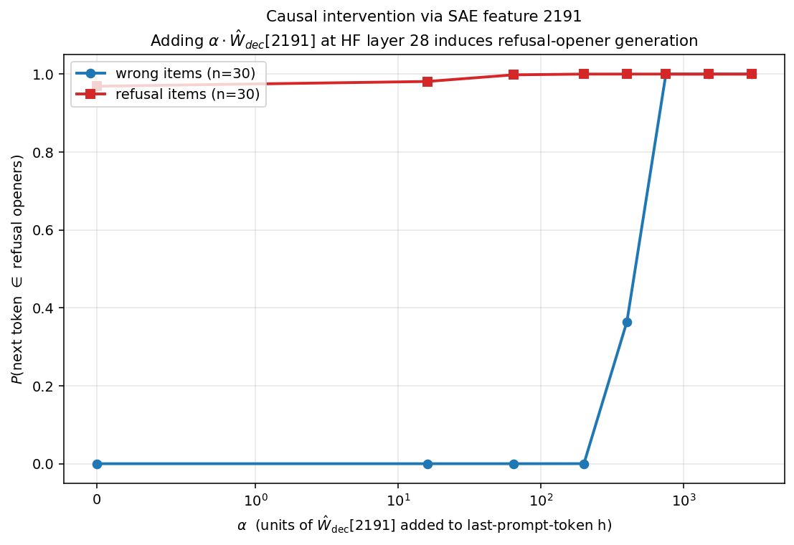

# Causal intervention via SAE feature 2191

**Hypothesis:** Feature 2191's decoder direction is the canonical refusal-opener
direction in Qwen3-1.7B at HF layer 28. Adding $\alpha \cdot \hat W_{dec}[2191]$ to
the last-prompt-token hidden state should induce refusal-opener generation.

**Items:** 30 wrong + 30 refusal (baseline from v1.3, judge_label-labeled).
**Opener token set:** ' as', ' As', 'As', 'as', ' there', '作为', '作为一个', '作為', '\tas', '-as' (decoded to 10 unique token IDs).

## Dose-response

| alpha | wrong P(opener) | wrong argmax-in-opener | refusal P(opener) | refusal argmax-in-opener |
|--:|--:|--:|--:|--:|
| 0.0 | 0.000 | 0/30 | 0.969 | 30/30 |
| 16.0 | 0.000 | 0/30 | 0.981 | 30/30 |
| 64.0 | 0.000 | 0/30 | 0.998 | 30/30 |
| 200.0 | 0.000 | 0/30 | 1.000 | 30/30 |
| 400.0 | 0.364 | 11/30 | 1.000 | 30/30 |
| 750.0 | 1.000 | 30/30 | 1.000 | 30/30 |
| 1500.0 | 1.000 | 30/30 | 1.000 | 30/30 |
| 3000.0 | 1.000 | 30/30 | 1.000 | 30/30 |

