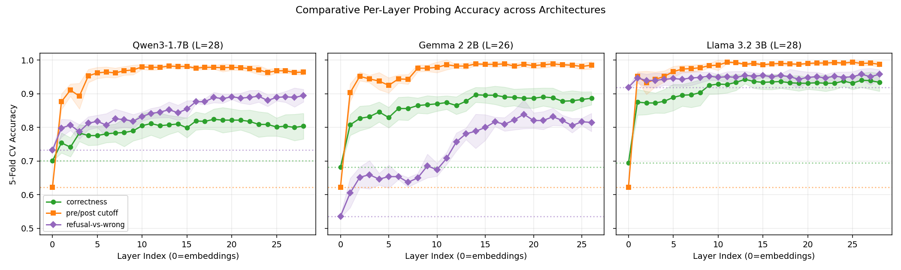

# 1. Introduction

A language model **confabulates** when it produces a fluent, confident answer that is
factually wrong (the term follows Farquhar et al. 2024). Kadavath et al. (2022) argued that LLMs “mostly know what they know”: signals internal to the model can predict whether a given answer will be correct. A probing literature has
followed (Azaria and Mitchell 2023; Marks and Tegmark 2024), fitting linear classifiers
on model hidden states and reporting correctness-prediction accuracies in the
$80$--$90\%$ range. Behavioral detectors, such as sampling
consistency (Manakul et al. 2023) or semantic entropy (Farquhar et al. 2024), work on the outputs instead and are the black-box complement to the white-box probes studied here. Two concurrent
2026 studies push back: Singh et al.\ show that above-chance “introspection” probe accuracy
on small LMs is explained by features of the prompt itself rather than privileged
self-access; Sahoo et al.\ find the same pattern for reasoning-mode probes. The question
is no longer whether the probe's numbers are high, but whether they are *evidence*.

This paper is a comprehensive small-LM test of that question. I introduce **ConfabQA**,
a probing benchmark structured as 4 domains $\times$ 3 categories (well-known pre-cutoff,
*obscure* pre-cutoff, post-cutoff). The third category (items whose answers existed in
the model's training data but on which the model is expected to fail) populates the cell
that standard pre-vs-post-cutoff designs leave empty, breaking the cutoff/correctness
confound that lets a probe predicting "correct" double as a probe predicting "pre-cutoff
date." ConfabQA, plus 800-item samples of PopQA (Mallen et al. 2023) and TriviaQA (Joshi
et al. 2017), are run through three instruction-tuned models in the $1.7$--$3$B range
(Qwen3-1.7B, Gemma 2 2B, Llama 3.2 3B), with Qwen3-4B as a within-family scaling
control. Every probe is reported against both the
standard majority baseline and a stricter logistic-regression-on-question-text baseline: a control rarely applied in the probing literature, but the one that decides whether the
hidden state contributed anything.

**Linear probing as a tool.** The diagnostic-classifier framework was introduced by Alain
and Bengio (2017): fit a linear classifier on the hidden representation at each layer of a
trained network to test whether a property is linearly decodable. Subsequent
interpretability work (Belrose et al. 2023 on tuned lenses, Burns et al. 2023 on
contrast-consistent probes) has applied probing to large LMs specifically. The present
work uses the same machinery but with a prompt-feature control baseline. This is a
*selectivity control* in the lineage of Hewitt and Liang (2019), who showed that probe
accuracy without a control task mostly measures the probe rather than the representation;
Belinkov (2022) surveys the same failure modes. Controls of this kind remain rare in the
correctness-probing literature.

**Knowledge cutoff and the disconfound.** Several prior probing papers use time-sensitive
question sets and conflate "post-cutoff" with "model doesn't know." The ConfabQA $4 \times
3$ design (§3) is motivated by exactly this conflation; the prompt-feature baseline (§4)
is motivated by the observation that even after the cutoff confound is removed, *some*
feature of the question text still trivially predicts correctness on small LMs.

**Closest mechanistic analogue.** Ferrando et al.\ (ICLR 2025) identify *entity-recognition
latents* in Gemma-2 SAEs that causally steer the model between knowledge-grounded answers
and refusals on factual questions, similar to the Qwen3-1.7B experiment here
(§5.9). The present work extends that line in two ways: (i) it recovers the same
class of feature via a linear probe + SAE pipeline on a different model family with a
$4 \times 3$ disconfounded benchmark; and (ii) it adds the cross-dataset transfer
experiment (§7.3) that asks whether the recovered direction is *content-invariant* (as
the entity-recognition framing suggests) or dataset-local.

**Findings.** Two complementary results emerge from the comprehensive read that no
single-model, single-dataset study could:

1. *A clean refusal direction in all three models, decomposable into interpretable SAE
   features.* On the wrong+refusal subset of ConfabQA the late-layer probe beats the
   strongest prompt baseline on every model: $+7.4$ pp on Qwen3-1.7B, $+16.3$ on
   Gemma 2 2B, $+2.2$ on Llama 3.2 3B. The less predictable a model's refusals are
   from the question text alone, the more the probe adds (Section 6.2). A one-shot residual-stream
   intervention drives the first-token refusal-opener rate to $100\%$ on Qwen3 and
   Gemma (Sections 5.8 and 6.2). This replicates Arditi et al.'s (2024)
   single-direction refusal finding on three model families, with the cutoff variable
   controlled by construction. The regime differs: theirs is safety refusal on harmful
   prompts, here it is epistemic abstention on unknown-answer questions. The direction
   is not, however, a single feature. A sparse-autoencoder decomposition resolves it
   into a canonical refusal-opener feature, a dormant apology-opener alternative, and
   two content-cue detectors (Section 5.9). The opener feature alone is causally
   sufficient to flip $30/30$ wrong-item next-token argmaxes to refusal openers.

2. *Llama 3.2 3B carries a substantially larger and more general correctness signal than
   Qwen3-1.7B or Gemma 2 2B.* On balanced PopQA / TriviaQA subsamples, Llama's probe
   beats the prompt baseline by $+21$--$+25$ pp, $5.7\times$ and $2.2\times$ Qwen's
   margins on the same benchmarks. Three controls localize the source: it is not
   parameter count (a Qwen3-4B within-family scaling control moves the margin by less
   than $2$ pp; Section 7.1); it is not dataset-specific (Llama's probe keeps
   $\approx 81\%$ of its margin when transferred across datasets without refit, where
   Qwen's and Gemma's transfer collapses; Section 7.3); and it is not refusal-channel
   readout ($\approx 83\%$ of the margin survives dropping refusals, and an independent
   refusal probe adds a further $+18$--$+25$ pp gap; Section 7.2). Gemma is intermediate
   in behavior (refusal rate and refusal-probe margin between the other two), yet
   its correctness probe is the most dataset-local of the three. The most plausible
   single explanation: Llama's heavy calibrated-abstention training forces a
   content-invariant "model is uncertain" representation; neither Qwen3's nor Gemma's
   training developed it.

The contribution is a comprehensive small-LM probing study with the prompt-feature baseline
applied uniformly: a curated benchmark whose design controls for the cutoff confound, a
cross-dataset bootstrap that exposes the cross-model gap, a refusal-channel attribution
that partitions the gap, an SAE decomposition that resolves the refusal direction into
interpretable features with causal validation, and a cross-dataset transfer experiment that
asks whether the recovered correctness signal is universal or local to its training set.

# 2. Theoretical background

The subject models are decoder-only transformers with causal attention. The model reads
the prompt $x_{1:T}$ as a token sequence; in every layer, each position attends only to
positions at or before it (the causal mask), so the state at position $t$ is a function
of $x_{1:t}$ alone. The final-layer state at the last position is projected through the
language-model (LM) head, the output projection onto the vocabulary
$\mathcal{V}$, into a probability distribution over the next token, and generation
repeats this one token at a time, feeding each emitted token back as input
(Figure \ref{fig:tokenflow}a). The *prefill* pass (Figure \ref{fig:tokenflow}b) is the
single forward pass over the prompt alone, before any token is generated; it is the
pass the probes of this paper read. Qwen3-1.7B
instantiates this with $L = 28$ blocks, hidden size $d = 2048$, and a vocabulary of
$|\mathcal{V}| \approx 152{,}000$ tokens with tied input/output embeddings (Methods §4 lists the checkpoint and settings). This section
defines the two confidence metrics used in §5.2 (§2.1), the prefill hidden state the
probes read (§2.2), the linear-probe pipeline (§2.3), and the two confounds that
motivate the dataset and baseline design (§2.4).

\begin{figure}[t]
\centering
\input{figures/tokenflow_tikz}
\caption{Token flow in the two forward-pass regimes. \textbf{(a)} Conventional
generation runs one forward pass per generated token, feeding each emitted token back
into the input. \textbf{(b)} The prefill pass stops just before the first generated
token; the hidden state at that moment, $h^{(\ell)}_T$, is saved at every layer $\ell$
and is what the probes read. Generation starts from exactly this state, so it is the
model's representation immediately before it commits to an answer; stacked over
questions it forms the probe input tensor $(n,\ L{+}1,\ d) = (784,\ 29,\ 2048)$. The
dimensions ($L{=}28$, $d{=}2048$) are specific to Qwen3-1.7B; the other subject models
differ in both depth and width.}
\label{fig:tokenflow}
\end{figure}

## 2.1 Confidence metrics: log-probability and entropy

At each generation step $t$ the model produces a probability distribution $p_t(\cdot)$
over the next token. All generation in this paper is greedy (`do_sample=False`,
equivalent to temperature $0$, hence deterministic), so the emitted token is the mode
of $p_t$. Two scalar summaries of the
generated response recur in §5, both means over the $T_g$ generated positions
($t = T, \ldots, T+T_g-1$, with $T$ the prompt length and $T_g \le 64$):

\begin{equation}
\bar\ell = \frac{1}{T_g} \sum_{t=T}^{T+T_g-1} \ell_t,
\qquad \ell_t = \log \max_{x \in \mathcal{V}} p_t(x),
\label{eq:lbar}
\end{equation}

\begin{equation}
\bar H = \frac{1}{T_g} \sum_{t=T}^{T+T_g-1} H_t,
\qquad H_t = -\sum_{x \in \mathcal{V}} p_t(x) \log p_t(x)
       = \mathbb{E}_{x \sim p_t}\!\left[-\log p_t(x)\right].
\label{eq:hbar}
\end{equation}

**Mean per-token log-probability $\bar\ell$.** In \eqref{eq:lbar}, $\ell_t$ is the
log-probability of the token emitted at step $t$ (the argmax, under greedy decoding).
The log, rather than the raw probability, makes the per-step values additive:
$T_g \bar\ell$ is the log-probability of the entire generated answer, so $\bar\ell$ is
the length-normalized answer likelihood. Equivalently, $\exp(\bar\ell)$ is the geometric
mean of the per-token probabilities, so $\bar\ell = -0.05$ corresponds to $\approx 0.95$
per token. $\bar\ell$ close to $0$ means every step was
near-certain; more negative means some steps were close ties. I also report
$\min_t \ell_t$ as a worst-step diagnostic.

**Mean per-token entropy $\bar H$.** In \eqref{eq:hbar}, $H_t$ is the Shannon entropy
of $p_t$ in nats; the second form reads it as the expected surprisal of a token drawn
from $p_t$. It measures the shape of the whole distribution, independent of which token
was chosen: a near-deterministic $p_t$ has $H_t \approx 0$, a uniform one has
$H_t = \log|\mathcal{V}|$.

**$\bar\ell$ and $\bar H$ measure different things.** $\ell_t$ looks at one token, the
mode of $p_t$; $H_t$ is a probability-weighted average of $-\log p_t(x)$ over all
tokens. So $\bar\ell$ asks “how confident was the model in the token it picked,” while
$\bar H$ asks “how concentrated was the whole distribution.” The two are tightly
anti-correlated empirically (Figure \ref{fig:confidence}b, §5.2) but can come apart:
one dominant mass plus a long thin tail of plausible alternatives gives large $H_t$
(many small probabilities, each multiplied by a large $-\log p$) while $\ell_t$ stays
close to $0$.

## 2.2 The prefill hidden state as the canonical going-in representation

When the model is asked a question, the *prefill* pass (a single forward pass over the prompt
$x_{1:T}$) produces the full hidden-state tensor $h^{(\ell)}_t$ for $\ell = 0, \ldots, L$ and
$t = 1, \ldots, T$. I pick off the **hidden state at every layer just before the first generated token**
(the last prompt position), $\{h^{(\ell)}_T\}_{\ell=0}^{L}$, yielding a tensor of shape
$(L+1, d) = (29, 2048)$ per question.
Here $T$ is the final token of the *question itself*: nothing has been generated yet,
so $\{h^{(\ell)}_T\}$ is the model's state at the moment it is about to emit the first
answer token: its representation *immediately before it commits to the answer*
(Figure \ref{fig:tokenflow}b). Three reasons this is the natural probe target:

1. **Causal masking.** Because attention is causal, $h^{(\ell)}_T$ summarizes the whole prompt
   seen so far; no later prompt-position state contains additional information about the prompt.
2. **Output-locality at the final layer.** $h^{(L)}_T$ is, up to RMSNorm and a linear projection,
   the first answer token's logit vector. A property linearly decodable from $h^{(L)}_T$ is, by
   construction, available to the model's output head at the moment of commitment.
3. **Avoidance of generation contamination.** Probing the hidden state of *generated* tokens
   conflates "what the model knows" with "what the model has already committed to saying," because
   the generated prefix is itself fed back as input. The prefill state at $T$ is the cleanest
   pre-commitment representation.

## 2.3 Why a linear probe (and the specific pipeline I use)

Following Alain and Bengio (2017), I fit at each layer $\ell$ a binary linear classifier on
$\{h^{(\ell)}_T\}$ predicting a property of interest. A linear probe at layer $\ell$ achieving
accuracy substantially above the appropriate baseline implies that there exists a hyperplane in
$\mathbb{R}^d$ that separates the property in the representation at depth $\ell$. Equivalently:
the linear span of the hidden state contains a direction along which the property is decodable.
Whether the model *uses* that direction is a separate question.

Figure \ref{fig:pipeline} shows the probe pipeline. With $n = 784$
items and $d = 2048$ features, training a raw logistic regression directly on the hidden
states would massively overfit: with more free parameters than training items, the
classifier can separate arbitrary labels without learning anything generalizable. The
pipeline `StandardScaler -> PCA(n_components=16) -> LogisticRegression(max_iter=2000,
C=1.0)` (the hyperparameter `C` is sklearn's inverse regularization strength, left at its default)
projects onto the top 16 principal directions before fitting, keeping the ratio of
training items to fitted parameters at $\approx 19{:}1$ instead of $\approx
0.15{:}1$. Both the scaler and PCA are fit only on the training fold (`sklearn.Pipeline`
semantics) so no test-fold leakage occurs. 5-fold stratified CV (each fold preserves
the class balance) with `random_state=0` produces five held-out evaluations per layer;
I report the mean and per-fold std of accuracy. Appendix G sweeps
$n_{\mathrm{components}}$ over $\{4, 8, 16, 32, 48, 64\}$ to show the headline numbers
are not specific to 16.

\begin{figure}[t]
\centering
\input{figures/pipeline_tikz}
\caption{Per-layer linear-probe pipeline. At each layer $\ell$, the $n \times d$ matrix
of captured hidden states is passed through StandardScaler $\to$ PCA(16) $\to$ logistic
regression and evaluated with stratified 5-fold CV, separately for each binary target.}
\label{fig:pipeline}
\end{figure}


## 2.4 The two confounds and what counts as evidence

**Confound 1 (cutoff/correctness).** Answering wrong is naturally correlated with asking
about post-cutoff facts. A benchmark built from easy pre-cutoff questions plus post-cutoff
questions makes "the answer is correct" and "the question is pre-cutoff" nearly the same
label, so a correctness classifier is, in effect, a cutoff classifier: the probe may be
reading "this question mentions 2025", not "the model is about to be wrong". ConfabQA
disconfounds by adding *obscure pre-cutoff* questions (facts that were in the training
data but that the model still gets wrong) so that pre-cutoff no longer implies correct.
Keeping only pre-cutoff questions would also remove the confound, but it would remove
the refusals too: all of Qwen3-1.7B's refusals happen on post-cutoff questions (Section
5.1), so without the post-cutoff cell there would be no refusal behavior to study.
The disconfound test is then: fit the correctness probe *restricted to pre-cutoff items
only*; if its accuracy still exceeds the pre-cutoff majority baseline, the cutoff
variable cannot account for the probe's signal.

**Confound 2 (hidden state/prompt features).** A correctness probe that beats its majority baseline
is not yet evidence of *model-internal* self-knowledge. The probe might be reading features of
the question text that any classifier could extract: the year mentioned in the question (which
correlates with answerability), domain (some domains are easier), question length, presence of
particular keywords. The honest baseline is therefore a logistic regression on prompt-side
features alone, with no access to the model's hidden state. Section 4 specifies the exact feature
set; Section 5.6 reports the comparison. A hidden-state probe is only evidence of model-internal
information to the extent it beats this baseline by a margin outside per-fold noise.
Figure \ref{fig:baselines} summarizes the two baselines.

\begin{figure}[t]
\centering
\input{figures/baselines_tikz}
\caption{Baselines, fit on the same labels with no access to the hidden state: the
majority class, and a prompt-text classifier, TF-IDF (term-frequency /
inverse-document-frequency bag-of-words) plus logistic regression, with engineered
features and domain/category dummies. A probe is evidence of model-internal information
only insofar as it beats both; $h_{\rm adds}$ = probe peak $-$ strongest baseline (pp),
reported throughout \S\S5--7.}
\label{fig:baselines}
\end{figure}

This second baseline is the one the original probing literature most often omits. The cutoff
disconfound is necessary but not sufficient; the prompt-feature disconfound is what actually
distinguishes "the hidden state encodes self-knowledge" from "the hidden state encodes the
prompt, which encodes the answer."

# 3. Sourcing and curation of the ConfabQA question set

ConfabQA comprises 784 items in a $4 \times 3$ design: 4 domains (science, history, culture,
cinema) crossed with 3 categories (well-known pre-cutoff, obscure pre-cutoff, post-cutoff).
Per-cell counts:

\begin{table}[!htbp]
\small
\centering
\caption{ConfabQA cell counts: 4 domains \(\times\) 3 categories,
\(n = 784\).\label{tbl:cells}}
\begin{tabular}{@{}lrrrr@{}}
\toprule
domain & well-known & obscure & post-cutoff & total \\\midrule
science & 42 & 45 & 119 & 206 \\
history & 33 & 37 & 127 & 197 \\
culture & 34 & 34 & 121 & 189 \\
cinema & 34 & 37 & 121 & 192 \\
\textbf{total} & \textbf{143} & \textbf{153} & \textbf{488} &
\textbf{784} \\
\bottomrule
\end{tabular}
\end{table}

Items are generated from per-domain templated source files; each item carries a provenance URL
for its gold answer and a validation status field populated by an external LLM with web access.
Three iterations of the validation pipeline were run on the source files; the final one,
**ConfabQA** ($n=784$), is what the paper analyzes throughout. The full design,
schema, selection criteria, and known limitations are documented in
`data/QUESTIONS_v1_CARD.md`. A fifth domain (sports) was included in an early iteration
but produced $0/26$ correct across all three categories on this model, leaving no positive
examples for the within-pre-cutoff probe; sports is therefore excluded from the main
analysis and reported separately in Appendix D.

The third (`obscure`) category is the design innovation. It populates the cell
"answer-was-in-training-data but model-is-expected-to-fail," which the standard two-cell
design (pre-cutoff known-good vs.\ post-cutoff known-bad) leaves structurally empty.
A typical obscure item: "Who won the Academy Award for Best Actor at the 1968 ceremony
for 'In the Heat of the Night'?" (gold: Rod Steiger). The fact is on the public record, but
Qwen3-1.7B confidently answers with the wrong actor. The model scores $33.3\%$ on the
obscure cell against $62.2\%$ on well-known (Section 5.1).

The validation pipeline (`01_question_set.py --emit-validation-prompt` -> external LLM ->
`--apply-validation`) makes the set reproducible: re-running it against the same source files
and the same validation results yields a bitwise-identical question set, and gold corrections
leave an audit trail in `validation_notes`.

# 4. Methods

**Subject model.** Qwen3-1.7B (`Qwen/Qwen3-1.7B`; Qwen Team, 2025a), a 1.72B-parameter
text-only instruction-tuned decoder-only transformer (Apache 2.0). 28 transformer blocks, hidden dimension 2048. Loaded at
bfloat16 on Apple Silicon MPS with a CPU fallback; the model fits comfortably in 16 GB unified
memory with activation headroom.

**Generation.** Greedy decoding: `do_sample=False`, `max_new_tokens=64`, and
`enable_thinking=False`, which suppresses Qwen3's `<think>` reasoning trace so the answer
text is the answer. All generations are deterministic conditional on the prompt.

**Hidden-state capture.** For each question I run `model.generate(...)` with
`output_hidden_states=True` and `output_scores=True`. The prefill hidden states yield
one tensor of shape $(L+1, d) = (29, 2048)$
per question. These tensors are persisted to disk so the analysis is independent of the generation
step.

**Same-model judge.** Each generated answer is labeled by Qwen3-1.7B itself, called separately
with a structured prompt (see `judge.py`) that asks for one of three labels: `correct`,
`refusal`, or `wrong`. The prompt includes a decision rule and five worked examples to anchor the
small model's behavior; the parser is a regex on `Label:\s*(CORRECT|REFUSAL|WRONG)`. The judge
replaces the brittle substring-match grader used in earlier work.

Judge agreement is measured on the full ConfabQA benchmark using three annotators
applying the same three-way rule strictly: the Qwen3-1.7B judge; Claude Opus 4.7
re-grading from (`question`, `gold`, `model answer`) triples; and Google Deep Research
(DR; Gemini 3.1 Pro with web-search verification) independently grading each item. Claude's
labels cover a stratified $30$-item sample (`random.Random(42)`); DR and the
Qwen-judge cover all $784$.

\begin{table}[!htbp]
\small
\centering
\caption{Judge agreement on ConfabQA across three
annotators.\label{tbl:judge}}
\begin{tabular}{@{}
  >{\raggedright\arraybackslash}p{(\linewidth - 8\tabcolsep) * \real{0.5897}}
  >{\raggedleft\arraybackslash}p{(\linewidth - 8\tabcolsep) * \real{0.0897}}
  >{\raggedleft\arraybackslash}p{(\linewidth - 8\tabcolsep) * \real{0.1410}}
  >{\raggedleft\arraybackslash}p{(\linewidth - 8\tabcolsep) * \real{0.0897}}
  >{\raggedleft\arraybackslash}p{(\linewidth - 8\tabcolsep) * \real{0.0897}}@{}}
\toprule
\begin{minipage}[b]{\linewidth}\raggedright
pair
\end{minipage} & \begin{minipage}[b]{\linewidth}\raggedleft
items
\end{minipage} & \begin{minipage}[b]{\linewidth}\raggedleft
agree
\end{minipage} & \begin{minipage}[b]{\linewidth}\raggedleft
rate
\end{minipage} & \begin{minipage}[b]{\linewidth}\raggedleft
Cohen's \(\kappa\)
\end{minipage} \\\midrule
DR vs.~Qwen-judge (full ConfabQA) & \(784\) & \(682 / 784\) & \(87.0\%\)
& \(0.780\) \\
Claude vs.~Qwen-judge (stratified 30-item sample) & \(30\) & \(30 / 30\)
& \(100\%\) & \(1.000\) \\
\bottomrule
\end{tabular}
\end{table}

Cohen's $\kappa = 0.78$ (DR vs.\ Qwen-judge on all $784$ items) is in the
"substantial agreement" range (Landis and Koch, 1977). DR is systematically
stricter than the Qwen-judge ($467$ vs.\ $402$ wrong-labels across the benchmark);
Appendix C.1 decomposes the $102$ disagreements. The stricter Claude vs.\ Qwen-judge $30/30$ agreement on the smaller sample puts the Qwen-judge's disagreement
with a second independent LLM grader at $0/30$ on typical items ($\le 10\%$ at $95\%$
confidence by the rule of three); the residual
disagreement with the web-grounded DR grader ($13\%$) primarily reflects
DR's stricter containment rule and independent gold verification (see
below), not judge miscalibration on unambiguous cases.

The DR pass also web-verified the gold answer of every item and flagged
$3/784 \approx 0.4\%$ as containing a stated-premise error (`his_pc_09`: month wrong by
one; `his_pc_56`: year wrong by one; `his_pc_90`: dual premise error). These items are
retained in the main analysis because dropping them does not shift any headline number,
but v2 will patch them at the source and re-run the affected cells.

**Hidden-state probe pipeline.** For each binary target and each layer $\ell$, I extract the
$n \times d$ matrix of last-prompt-token hidden states at depth $\ell$ and fit a `StandardScaler`
$\to$ `PCA(n_components=16)` $\to$ `LogisticRegression(max_iter=2000, C=1.0)` pipeline under
5-fold stratified cross-validation (`random_state=0`). I report the mean and standard deviation
of fold accuracy, plus a "layer range" defined as the set of layers whose accuracy is within
$1\sigma$ of the per-fold std of the peak.

**Prompt-feature baseline pipeline.** For each target, I also fit baselines that have no access
to the model's hidden state and report 5-fold CV accuracy on the *same folds*
(`random_state=0`) so the comparison to the hidden-state probe is direct. Four baselines of
increasing leniency:

- **TF-IDF (term frequency--inverse document frequency; strictest text-only)**:
  `TfidfVectorizer` (`ngram_range=(1,2)`, `min_df=2`, `max_df=0.95`,
  `sublinear_tf=True`) $\to$ `LogisticRegression(max_iter=2000, C=1.0)`, fit on the
  raw question text. No engineered features, no metadata: the strongest "what could a bag-of-tokens
  classifier learn" baseline.
- **text-only (engineered)**: numeric features only (question character length, word count,
  has-year indicator, year value, number of capitalized words, digits, commas,
  ends-with-`?` indicator). No domain, no category dummies.
- **text + domain**: engineered features plus domain one-hot in $\{$science, history, culture,
  cinema$\}$.
- **text + domain + category**: full feature set including the human-assigned category dummy in
  $\{$well_known, obscure, post_cutoff$\}$. The `category` dummy is the *annotator's*
  expected-difficulty label and is therefore the least conservative baseline; comparing the
  hidden-state probe against it asks "does the model know more about specific facts than what
  the annotator's coarse difficulty bucket already predicts."

The honest comparison is the hidden-state probe vs.\ the *strongest* of these four baselines
on each target. That is the "h adds" column of Table \ref{tbl:hadds} in Section 5.6.

**Probe targets.**

- `correct`: binary `judge_label == "correct"`, on all 784 items.
- `cutoff`: binary `cutoff_class == "post"`, on all 784 items.
- `refusal_vs_wrong`: binary `judge_label == "refusal"`, on the subset of items with
  `judge_label in {refusal, wrong}` (n=549).
- `refusal_vs_wrong_within_post`: same target, restricted further to post-cutoff items only
  (n=393). All 147 refusals in the dataset are post-cutoff, so this conditions out the
  cutoff covariate.
- `correct_within_pre`: binary `correct`, restricted to items with `cutoff_class == "pre"`
  (n=296). The cutoff disconfound test.
- `correct_within_obscure`: binary `correct`, restricted to items with `category == "obscure"`
  (n=153). The popularity disconfound test.

**Bootstrap protocol (Sections 7.1, 7.2).** For each `(dataset, model, target)` cell,
partition the pool into the two target classes, set $n_{\text{class}} = \min(|\rm pos|,
|\rm neg|, 400)$, and draw $K = 30$ random 50/50 subsamples without replacement. On each
subsample refit the full probe pipeline (StandardScaler $\to$ PCA($16$) $\to$ LR, $5$-fold
CV at `random_state=0`, peak over all $29$ layers) plus the four prompt baselines on the
same folds. The subsample $h_{\rm adds}$ is $\text{probe peak} - \max(\text{baselines})$
in pp. The reported $\bar h_{\rm adds}$ is the mean across $K$; the 95\% CI is the
percentile interval $[h_{(0.025K)}, h_{(0.975K)}]$. This controls class-imbalance
interactions between probe and baselines and item-sampling noise within the pool.
$K=30$ is set by compute (each replicate refits the full $29$-layer $\times$ $5$-fold
pipeline), and percentile CIs at $K=30$ are correspondingly coarse. The
protocol is "resampling-of-balanced-subsamples" rather than a true item-level bootstrap;
the latter would require $K \cdot L \cdot F \approx 4{,}350$ refits per cell, too slow on
M1-class hardware (see the evaluation-methodology limitation in Section 9).

**External-dataset evaluation (Section 7.1).** Two external benchmarks are evaluated
end-to-end using the same `02_evaluate.py` generation pipeline (greedy decoding,
`enable_thinking=False`, last-prompt-token hidden-state capture at every layer) and the same
`judge.py` three-way Qwen3-1.7B judge:

- **PopQA** (Mallen et al. 2023): $14$k Wikidata triples templated into natural-language
  questions. Sampled $n=800$ stratified by `o_pop` (object popularity, $5$ quintile bins of
  $160$ items each), reshuffled at `seed` $\in \{0, 1, 2\}$.
- **TriviaQA** (Joshi et al. 2017): `mandarjoshi/trivia_qa unfiltered.nocontext` validation
  split. Sampled $n=800$ uniformly, reshuffled at `seed` $\in \{0, 1, 2\}$.

Running three seeds per `(subject model, dataset)` widens the unique-item pool to
$n_{\text{unique}} \approx 2{,}200$, from which the $K=30$ balanced bootstrap subsamples are
drawn (Llama runs are single-seed; Llama pools have $n_{\text{unique}} = 800$). The subject
model is switched via the `MODEL_ID` environment variable; the judge remains Qwen3-1.7B in
all runs (Section 9's scope-and-judge-generalization limitation records the
Qwen-judge-on-Llama-outputs caveat).

**Refusal-channel attribution (Section 7.2).** Two follow-up tests use the same bootstrap
protocol as above, restricted to the four cells with appreciable refusal counts:

- *Test A* (drop refusals): filter the pool to `judge_label` $\in$ \{`correct`, `wrong`\}, then
  balance correct vs.\ wrong 50/50. The probe target now strictly excludes refusals; any
  $h_{adds}$ that survives is genuine correct-vs-wrong discrimination among items the model
  attempted to answer.
- *Test B* (probe refusal directly): target is `judge_label == 'refusal'`. Balance refusal
  vs.\ non-refusal 50/50, refit probe + baselines. Probe absolute accuracy measures how
  cleanly the abstention decision is encoded; $h_{adds}$ measures the prompt-text-conditional
  predictability gap.

# 5. Probing Qwen3-1.7B

Before reporting numbers, Figure \ref{fig:atlas} situates them geometrically. Panel (a) is a
*supervised* 2-D projection of the layer-18 hidden states for all 784 questions (each axis the
signed perpendicular distance to a probe hyperplane in PCA(16) hidden-state space), with each
point carrying three encodings at once: color for the judge label, marker shape for the
question category, marker size for the model's mean per-token log-probability. Panel (b) is
the *unsupervised* PCA(2) projection of the same hidden states under the same encoding, as a
control: it shows what structure already lives in the top two variance directions of the
representation without any supervision.

![**Confabulation Atlas (layer 18 hidden state).** Each point is one question: color = judge
label (green correct, blue refusal, red wrong), shape = category (circle well-known, diamond
obscure, triangle post-cutoff), size = mean per-token log-probability (larger = more
confident). **(a) Supervised projection.** **X:** signed distance to the correctness
hyperplane (target `judge_label == "correct"`, all $n=784$, 5-fold CV acc $82.4\%$). **Y:**
signed distance to the refusal-vs-correct hyperplane (target `refusal` vs `correct`, fit on
the n=382 refusal+correct subset, 5-fold CV acc $96.1\%$, orthogonalized against X for
plotting; raw angle between the two hyperplane normals in 16-d PCA space is $55.7^\circ$).
Wrong items, never seen during the Y fit, fall between the refusal pole (top) and the correct
pole (bottom). **(b) Unsupervised control.** PCA(2) of the same hidden state, same encoding:
even without supervision, PC1 and PC2 already carry visible refusal-vs-rest structure (a
probe on PC1+PC2 alone reaches $86.9\%$ on the refusal-vs-wrong target, vs.\ $73.2\%$
majority). The "atlas" is therefore not an artifact of supervised projection: the underlying
hidden state already separates refusal in its top-variance directions. Whether the
*correctness* separation visible in panel (a) reflects model-internal self-knowledge or
simply prompt-readable features is the subject of Section
5.6.](figures/qwen3_1_7b/atlas_merged_layer18.png){#fig:atlas}

This section dissects the subject model in two arcs. Sections 5.1--5.3 set the
behavioral stage: accuracy by stratum, what text-level confidence can and cannot see,
and the confident-confabulation failure mode. Sections 5.4--5.9 recover the hidden-state
structure: unsupervised geometry, per-layer probes, the prompt-feature control, and the
refusal direction's token signature, causal role, and SAE decomposition. Sections 6
and 7 then test what survives a change of model and a change of dataset.

## 5.1 Accuracy by stratum

**Overall.** Of 784 items, 235 (30.0%) are graded `correct` by the judge; 147 (18.8%) are
`refusal`; 402 (51.3%) are `wrong`; Table \ref{tbl:bycategory} gives the full
per-category breakdown.

\begin{table}[!htbp]
\small
\centering
\caption{Judge-label counts, accuracy, and mean per-token log-probability by
category.\label{tbl:bycategory}}
\begin{tabular}{@{}lrrrrrr@{}}
\toprule
category & n & correct & refusal & wrong & accuracy & mean logprob \\\midrule
well-known (pre-cutoff) & 143 & 89 & 0 & 54 & 62.2\% & \(-0.120\) \\
obscure (pre-cutoff) & 153 & 51 & 0 & 102 & 33.3\% & \(-0.149\) \\
post-cutoff & 488 & 95 & 147 & 246 & 19.5\% & \(-0.145\) \\
\midrule
\textbf{total} & 784 & 235 & 147 & 402 & 30.0\% & \(-0.141\) \\
\bottomrule
\end{tabular}
\end{table}

**By cutoff class and category.** The cutoff manipulation works as designed:
pre-cutoff accuracy is 47.3% (140/296) against 19.5% (95/488) post-cutoff, and the
$4 \times 3$ design produces the expected ordering, with the obscure-pre-cutoff cell
sitting cleanly between the well-known and post-cutoff cells.

The obscure-pre-cutoff cell is the benchmark's innovation. The model fails on $\approx 66.7\%$ of items
whose answers existed in its training data: exactly the population needed to test the cutoff
disconfound. Mean log-probability also stratifies: the model is *least* confident on the obscure
pre-cutoff items, even though it is more confident on post-cutoff items where it more often
refuses (refusals are themselves fluent and high-confidence; see Section 5.3).

**By judge label.** The refusal column of Table \ref{tbl:bycategory} carries the
distribution's key asymmetry: all 147 refusals fall in the post-cutoff cell. The
model never refuses on pre-cutoff items in this dataset, suggesting that "refusal" in Qwen3-1.7B is triggered specifically by the
knowledge-cutoff cue ("As of my knowledge cutoff in 2023...") rather than by intrinsic uncertainty
about the answer. This observation motivates the `refusal_vs_wrong_within_post` probe defined in
Section 4, which conditions out the cutoff covariate by construction.

**By domain.** Per-domain accuracies and the per-domain x cutoff breakdown are in Appendix A.

## 5.2 Text-level confidence

Mean per-token log-probability separates correct from incorrect answers in expectation but with
substantial overlap (Figure \ref{fig:confidence}a). The means are
$\bar{\ell}_{\mathrm{correct}} \approx -0.10$ vs.\ $\bar{\ell}_{\mathrm{incorrect}} \approx
-0.15$ ($\approx 0.90$ vs.\ $\approx 0.86$ geometric-mean per-token probability); the
distributions overlap heavily in the $[-0.2, -0.05]$ range. Per-item logprob is
therefore weakly informative as a confidence signal but not a usable correctness predictor on its
own. The hidden-state analyses of Sections 5.4--5.6 target the residual signal beyond what this scalar captures.

Figure \ref{fig:confidence}b shows that the correctness/cutoff interaction is also visible in
joint logprob-entropy space, with post-cutoff items concentrated in the lower-confidence
region of the plane (lower mean logprob, higher mean entropy) and pre-cutoff correct items
concentrated near zero. The substantial overlap between pre-cutoff-correct and
post-cutoff-correct in the high-confidence corner is the visual analogue of "logprob alone
does not separate confabulation from correct".

{#fig:confidence}

## 5.3 Confident-confabulation case studies

Table \ref{tbl:topwrong} lists, for each of the two failure labels, the five items
with the highest mean per-token log-probability $\bar\ell$. The five confabulations all
sit at $\approx 0.95$ geometric-mean per-token probability.

<!-- Raw table float, not a pipe table: pandoc renders pipe tables as
longtable, which page-breaks; this table should sit on a single page.
Column spec mirrors the pandoc longtable it replaces. -->
\begin{table}[!t]
\small
\caption{The five highest-confidence confabulations (top block) and refusals
(bottom block; all post-cutoff). Questions and answers are excerpts from the
released response files.\label{tbl:topwrong}}
\begin{tabular}{@{}
  >{\raggedright\arraybackslash}p{(\linewidth - 8\tabcolsep) * \real{0.1412}}
  >{\raggedright\arraybackslash}p{(\linewidth - 8\tabcolsep) * \real{0.2941}}
  >{\raggedright\arraybackslash}p{(\linewidth - 8\tabcolsep) * \real{0.1647}}
  >{\raggedright\arraybackslash}p{(\linewidth - 8\tabcolsep) * \real{0.3412}}
  >{\raggedleft\arraybackslash}p{(\linewidth - 8\tabcolsep) * \real{0.0588}}@{}}
\toprule
id & question (abridged) & gold & model said (excerpt) & $\bar\ell$ \\
\midrule
\textbf{\emph{wrong}} & & & & \\
cin\_pc\_41 & Ridley Scott's November 2024 sequel to \emph{Gladiator}? &
Gladiator II & ``There is no film directed by Ridley Scott that is a
sequel to \emph{Gladiator}\ldots{}'' & $-0.047$ \\
cul\_ob\_12 & Which 1971 Walker Percy novel won the National Book Award?
& Love in the Ruins & ``\ldots was `The Crying of Lot 49'\,'' & $-0.049$ \\
cin\_ob\_24 & Who directed `Three Colors: Blue' (1993)? & Krzysztof
Kieslowski & ``\ldots was directed by Jean-Pierre Jeunet'' & $-0.049$ \\
his\_ob\_35 & Who was the 27th US President, 1909--1913? & William
Howard Taft & ``\ldots was Theodore Roosevelt'' & $-0.050$ \\
his\_ob\_30 & Who was Chancellor of West Germany, 1969--1974? & Willy
Brandt & ``\ldots was Konrad Adenauer'' & $-0.052$ \\
\textbf{\emph{refusal}} & & & & \\
his\_pc\_38 & Treasury Secretary in the second Trump administration,
January 2025? & Scott Bessent & ``As of January 2025, there is no
Secretary of the Treasury\ldots{}'' & $-0.049$ \\
cin\_pc\_14 & Who starred in Bong Joon-ho's 2025 film `Mickey 17'? &
Robert Pattinson & ``As of my knowledge cutoff in 2023, there is no 2025
film titled \emph{Mickey 17}\ldots{}'' & $-0.055$ \\
cul\_pc\_20 & Which Taylor Swift album was released on April 19, 2024? &
The Tortured Poets Department & ``As of my knowledge cutoff in 2024,
there is no official announcement\ldots{}'' & $-0.060$ \\
cin\_pc\_114 & 2025 Best Supporting Actor Academy Award, for `A Real
Pain'? & Kieran Culkin & ``As of the 2025 Academy Awards, there is no
official announcement\ldots{}'' & $-0.064$ \\
his\_pc\_33 & US Attorney General in the second Trump administration,
February 2025? & Pam Bondi & ``As of February 2025, there is no United
States Attorney General\ldots{}'' & $-0.067$ \\
\bottomrule
\end{tabular}
\end{table}

The confabulations exemplify the canonical failure mode: the model produces a
plausible-sounding specific answer with a recognizable name from the right time period
and category, at high text-level confidence. Four of the five are obscure pre-cutoff
items, where the model had partial training-data exposure to the gold answer; the fifth
is post-cutoff, where it had none.

Refusals are paradoxically *high-confidence* text outputs: the model is fluent and assertive
about its lack of knowledge. A binary substring grader lumps both failure modes into the
same `incorrect` bucket, since neither a refusal nor a confabulation contains the gold
string; and because refusals are as confident as confabulations, text-level confidence
cannot separate the two afterward either. Separating them is what the three-way judge of
Section 4 is for.

A gold-side validation case study (a muon half-life gold error caught and corrected
by the external validation pass) is in Appendix C.

## 5.4 Hidden-state geometry at two layers

Unsupervised PCA(2) projections of the raw hidden state at a middle layer (14) and the
final layer (28) already show the structure the supervised probes recover.

![Hidden-state geometry, unsupervised. PCA(2) of the last-prompt-token hidden state at a
mid-network layer (left) and the final layer (right), $n=784$. Each point is one question,
encoded on three channels at once: color is the judge label (green correct, blue refusal,
red wrong), marker shape is cutoff class (circle pre-cutoff, triangle post-cutoff), and
marker size is the mean per-token log-probability (larger = more confident). At layer 14 the
classes mix heavily; by layer 28 the refusals (blue, necessarily post-cutoff) pull into a
distinct cluster with no supervision, the correct answers occupy the opposite side, and a
tight group of large red markers (the confident confabulations of Section
5.3) separates out on its own. The refusal cluster is the geometry the refusal-vs-wrong
probe reads.](figures/qwen3_1_7b/embeddings_pca_merged.png){#fig:embeddings}

The refusal cluster visible at layer 28 in Figure \ref{fig:embeddings} is the same structure that
drives the high refusal-vs-wrong probe accuracy reported below: by the deepest layers, refusals
occupy a geometrically distinct subregion of the hidden-state space, even without supervision.

## 5.5 Per-layer linear probes against majority baselines

![Per-layer probe accuracy for all five targets on Qwen3-1.7B (ConfabQA), on a single axis for
direct curve-shape comparison. Solid lines: probe accuracy per layer. Dotted horizontal
lines: per-target majority baseline. Dots mark each target's peak layer. **Cutoff** (orange)
saturates near $98\%$ by layer 13 and stays high through the network. **Refusal-vs-wrong**
(green, $n=549$) rises monotonically and peaks at the deepest block (layer 28).
**Correctness** (blue, $n=784$) and the cutoff-disconfounded **correct-within-pre** (red,
$n=296$) both peak at layer 18, with within-pre showing the headline $+32$ pp margin over
its $52.7\%$ pre-cutoff majority that largely vanishes against the prompt-feature baseline
of Section 5.6. **Correct-within-obscure** (purple, $n=153$) peaks at layer 7 but the
$1$-$\sigma$ layer range spans nearly the whole network, so the per-layer peak is not
statistically pinned at this sample size.](figures/per_layer_probes_merged.png){#fig:per-layer-probes}

**Probe peak summary (vs.\ majority baseline only):**

\begin{table}[!htbp]
\small
\centering
\caption{Probe peaks vs.~majority baselines (Qwen3-1.7B,
ConfabQA).\label{tbl:probepeaks}}
\begin{tabular}{@{}
  >{\raggedright\arraybackslash}p{(\linewidth - 12\tabcolsep) * \real{0.4487}}
  >{\raggedleft\arraybackslash}p{(\linewidth - 12\tabcolsep) * \real{0.0641}}
  >{\raggedleft\arraybackslash}p{(\linewidth - 12\tabcolsep) * \real{0.0641}}
  >{\raggedright\arraybackslash}p{(\linewidth - 12\tabcolsep) * \real{0.0897}}
  >{\raggedleft\arraybackslash}p{(\linewidth - 12\tabcolsep) * \real{0.1795}}
  >{\raggedleft\arraybackslash}p{(\linewidth - 12\tabcolsep) * \real{0.0769}}
  >{\raggedleft\arraybackslash}p{(\linewidth - 12\tabcolsep) * \real{0.0769}}@{}}
\toprule
\begin{minipage}[b]{\linewidth}\raggedright
target
\end{minipage} & \begin{minipage}[b]{\linewidth}\raggedleft
n
\end{minipage} & \begin{minipage}[b]{\linewidth}\raggedleft
best layer
\end{minipage} & \begin{minipage}[b]{\linewidth}\raggedright
1\(\sigma\) layer range
\end{minipage} & \begin{minipage}[b]{\linewidth}\raggedleft
peak acc
\end{minipage} & \begin{minipage}[b]{\linewidth}\raggedleft
majority
\end{minipage} & \begin{minipage}[b]{\linewidth}\raggedleft
margin
\end{minipage} \\\midrule
\texttt{correct} (all items) & 784 & 18 & 10--28 & \(0.824 \pm 0.031\) &
0.700 & \(+12.4\) \\
\texttt{cutoff} (all items) & 784 & 13 & 10--20 & \(0.982 \pm 0.005\) &
0.622 & \(+36.0\) \\
\texttt{refusal\_vs\_wrong} & 549 & 28 & 16--28 & \(0.894 \pm 0.019\) &
0.732 & \(+16.2\) \\
\texttt{refusal\_vs\_wrong\_within\_post} & 393 & 28 & 20--28 &
\(0.870 \pm 0.022\) & 0.626 & \(+24.4\) \\
\texttt{correct\_within\_pre} & 296 & 18 & 9--28 & \(0.848 \pm 0.038\) &
0.527 & \(+32.1\) \\
\texttt{correct\_within\_obscure} & 153 & 7 & 1--28 &
\(0.805 \pm 0.063\) & 0.667 & \(+13.8\) \\
\bottomrule
\end{tabular}
\end{table}

The 1$\sigma$ layer-range column matters: for the within-obscure probe at n=153, accuracies
across the entire 28-layer network are within one fold-standard-deviation of the argmax, so the
specific "peak layer 7" is not a meaningful per-depth claim; only the overall mean accuracy
is.

Taken at face value, these are the margins a single-model probing study would lead
with. Section 5.6 explains why every correctness margin in the table is overstated.

### 5.5.1 Refusal-vs-wrong probe under class imbalance

Bare accuracy ($0.894$) is misleading for the `refusal_vs_wrong` target because refusals are
$147/549 = 26.8\%$ of the wrong+refusal subset: a constant predictor of `wrong` already scores
$0.732$. The class-imbalance-aware metrics at the peak layer (28):

\begin{center}
\small
\begin{tabular}{@{}
  >{\raggedright\arraybackslash}p{(\linewidth - 2\tabcolsep) * \real{0.5000}}
  >{\raggedleft\arraybackslash}p{(\linewidth - 2\tabcolsep) * \real{0.5000}}@{}}
\toprule
\begin{minipage}[b]{\linewidth}\raggedright
metric
\end{minipage} & \begin{minipage}[b]{\linewidth}\raggedleft
value
\end{minipage} \\\midrule
confusion matrix
\([[\mathrm{TN}, \mathrm{FP}], [\mathrm{FN}, \mathrm{TP}]]\) &
\([[369, 33], [25, 122]]\) \\
accuracy & \(0.894\) \\
balanced accuracy & \(0.874\) \\
recall on refusals (TPR) & \(122/147 = 0.830\) \\
recall on wrong (TNR) & \(369/402 = 0.918\) \\
ROC AUC & \(0.944\) \\
\bottomrule
\end{tabular}
\end{center}

The probe is not defaulting to "wrong": it correctly flags 122 of 147 refusals, with a false
positive rate of $33/402 \approx 8.2\%$. The ROC AUC of $0.944$ indicates that the underlying
separation is genuinely strong: the probe ranks refusals well above confabulations in score
order.

## 5.6 The prompt-feature baseline: what survives, what does not

For each probe target, I fit the four baselines specified in Section 4 (TF-IDF on raw question
text; engineered text-only; +domain; +domain+category) and report the same 5-fold CV accuracy on
the same folds. The honest comparison is the hidden-state probe vs.\ the *strongest* of these
four baselines, since a hidden-state probe that doesn't beat the strongest baseline isn't
recovering anything the prompt itself does not already trivially yield.

\begin{table}[!htbp]
\small
\centering
\caption{Hidden-state probe vs.~the four prompt-feature baselines; ``h
adds'' = probe peak \(-\) strongest (bolded)
baseline.\label{tbl:hadds}}
\begin{tabular}{@{}
  >{\raggedright\arraybackslash}p{(\linewidth - 14\tabcolsep) * \real{0.4940}}
  >{\raggedleft\arraybackslash}p{(\linewidth - 14\tabcolsep) * \real{0.0723}}
  >{\raggedleft\arraybackslash}p{(\linewidth - 14\tabcolsep) * \real{0.0723}}
  >{\raggedleft\arraybackslash}p{(\linewidth - 14\tabcolsep) * \real{0.0723}}
  >{\raggedleft\arraybackslash}p{(\linewidth - 14\tabcolsep) * \real{0.0723}}
  >{\raggedleft\arraybackslash}p{(\linewidth - 14\tabcolsep) * \real{0.0723}}
  >{\raggedleft\arraybackslash}p{(\linewidth - 14\tabcolsep) * \real{0.0723}}
  >{\raggedleft\arraybackslash}p{(\linewidth - 14\tabcolsep) * \real{0.0723}}@{}}
\toprule
\begin{minipage}[b]{\linewidth}\raggedright
target
\end{minipage} & \begin{minipage}[b]{\linewidth}\raggedleft
majority
\end{minipage} & \begin{minipage}[b]{\linewidth}\raggedleft
TF-IDF
\end{minipage} & \begin{minipage}[b]{\linewidth}\raggedleft
text-only
\end{minipage} & \begin{minipage}[b]{\linewidth}\raggedleft
+domain
\end{minipage} & \begin{minipage}[b]{\linewidth}\raggedleft
+category
\end{minipage} & \begin{minipage}[b]{\linewidth}\raggedleft
\textbf{hidden state}
\end{minipage} & \begin{minipage}[b]{\linewidth}\raggedleft
\textbf{h adds}
\end{minipage} \\\midrule
\texttt{correct} & 0.700 & 0.767 & 0.773 & 0.779 & \textbf{0.800} &
\(0.824\) & \(+2.4\) \\
\texttt{cutoff} & 0.622 & 0.940 & 0.952 & 0.952 & \textbf{1.000} &
\(0.982\) & \(-1.8\) \\
\texttt{refusal\_vs\_wrong} & 0.732 & \textbf{0.820} & 0.803 & 0.805 &
0.800 & \(0.894\) & \(\mathbf{+7.4}\) \\
\texttt{refusal\_vs\_wrong}\texttt{\_within\_post} & 0.626 &
\textbf{0.774} & 0.741 & 0.730 & 0.730 & \(0.870\) &
\(\mathbf{+9.6}\) \\
\texttt{correct\_within\_pre} & 0.527 & 0.797 & 0.811 & 0.811 &
\textbf{0.818} & \(0.848\) & \(+3.0\) \\
\texttt{correct\_within}\texttt{\_obscure} & 0.667 & 0.752 &
\textbf{0.830} & 0.811 & 0.811 & \(0.805\) & \(-2.5\) \\
\bottomrule
\end{tabular}
\end{table}

(All baselines are 5-fold CV accuracy with `random_state=0`; the bolded baseline per row is the
strongest, and "h adds" is the hidden-state peak minus that strongest bolded baseline.)

**What the table says.**

1. **Cutoff is trivially prompt-readable: the cutoff probe is a manipulation check, not a
   result.** With the human-assigned `category` dummy, prompt features reach $100\%$ accuracy
   at predicting cutoff class; even the strictest TF-IDF baseline reaches $94.0\%$ because the
   year mentioned in the question is a near-perfect predictor of whether the answer existed at
   training time. The hidden-state probe at $98.2\%$ in fact underperforms the strongest prompt
   baseline by $-1.8$ pp. The high accuracy of the cutoff probe should therefore be read as
   evidence the model encodes a feature it can also extract from the question text directly: useful only as a sanity check that the probe pipeline is functional, not as a substantive
   finding about model internals.

2. **Correctness probes barely beat prompt features.** The all-items correctness probe gains
   $+2.4$ pp over the strongest baseline; the within-pre-cutoff probe (the headline disconfound
   result) gains $+3.0$ pp; the within-obscure probe is $-2.5$ pp *below* its strongest baseline.
   The per-fold standard deviations of the hidden-state probes for these targets are $0.031$,
   $0.038$, and $0.063$ respectively; the marginal gain is *within* the per-fold noise for every
   correctness target. On this single split, the hidden state adds no detectable
   information beyond prompt features for predicting correctness at this scale and on
   this dataset; the Section 7.1 balanced bootstrap later refines rather than overturns
   this: a small all-items margin emerges with a CI excluding zero, while the
   disconfounded within-pre and within-obscure margins remain consistent with zero.

3. **Refusal-vs-confabulation substantially beats prompt features.** The overall refusal-vs-wrong
   probe gains $+7.4$ pp over TF-IDF (the strongest baseline for that target); restricted to the
   post-cutoff subset where all refusals actually occur, it gains $+9.6$ pp. These gaps are
   $\approx 4$x the per-fold std of the probe ($0.019$ and $0.022$ respectively). This is the
   result of the paper that survives.

**Why this is the right comparison.** The hidden state is computed *from* the prompt, so
a probe that cannot beat the strongest prompt baseline has recovered nothing the input did
not already contain. The Section 2.4 disconfound is necessary but not sufficient: removing
the cutoff variable does not remove the prompt features the correctness probe was riding.

## 5.7 Probe-direction atlas: what the refusal signal points at in token space

The refusal-vs-wrong probe at layer 28 carries the paper's surviving signal. The probe is a
linear classifier in PCA(16) space; its weight vector $w \in \mathbb{R}^{16}$ can be lifted back
through the PCA basis $V$ and the per-feature standardization to a direction
$\mathbf{w}_{\mathrm{raw}} \in \mathbb{R}^{2048}$ in the original hidden-state space:
$\mathbf{w}_{\mathrm{raw}} = (V^\top w) \,/\, \boldsymbol{\sigma}$, with the sign chosen so the
refusal end is positive. Following the logit-lens convention I then push
$\mathbf{w}_{\mathrm{raw}}$ through the model's final RMSNorm and tied LM head:

$$\ell_v \;=\; \big[\mathrm{LMHead}\!\left(\mathrm{RMSNorm}(\mathbf{w}_{\mathrm{raw}})\right)\big]_v
  \qquad \text{for } v \in \mathcal{V}.$$

Tokens with the highest $\ell_v$ are tokens that the model's output head would assign high
probability to *if its layer-28 hidden state moved in the refusal direction*; tokens with the
lowest $\ell_v$ are tokens the head would suppress along that direction. This is the literal
"atlas" of this section's title: a single direction in Qwen3-1.7B's representational space,
recovered from a labeled probe, that maps to a coherent neighborhood in token space.

**Top tokens along the refusal direction (full subset, n=549).**

\begin{table}[!htbp]
\small
\centering
\caption{Top tokens along the refusal direction (logit-lens projection,
full subset \(n = 549\)).\label{tbl:toptokens}}
\begin{tabular}{@{}rlrlrlr@{}}
\toprule
rank & token & logit & & rank & token & logit \\\midrule
1 & \texttt{as} & \(+19.22\) & & 9 & \texttt{\_AS} & \(+15.19\) \\
2 & \texttt{作为一个} & \(+17.67\) & & 10 & \texttt{(as} & \(+14.47\) \\
3 & \texttt{作为} & \(+17.14\) & & 11 & \texttt{there} & \(+14.16\) \\
4 & \texttt{as} & \(+16.76\) & & 12 & \texttt{作為} & \(+13.43\) \\
5 & \texttt{As} & \(+15.96\) & & 13 & \texttt{作为一名} & \(+13.24\) \\
6 & \texttt{As} & \(+15.48\) & & 14 & \texttt{.getAs} & \(+13.12\) \\
7 & \texttt{\textbackslash{}tas} & \(+15.35\) & & 15 & \texttt{asString}
& \(+12.94\) \\
8 & \texttt{-as} & \(+15.25\) & & & & \\
\bottomrule
\end{tabular}
\end{table}

The top of the list is exactly the vocabulary of refusal openings: " as" (1), "as" (4), "As"
(5), " As" (6); the model's refusals near-universally begin with "As of my knowledge cutoff
in 2023..." or "As of January 2025...". Qwen3 is multilingual; the Chinese refusal opener "作为"
("as" / "as a") appears at ranks 2, 3, 12, 13. The direction also picks up " there" (rank 11),
the second-most-common refusal opening ("There is no [confirmed/official] ..."). The remaining
top items (`(as`, `_AS`, `.getAs`, `asString`) are rarer code-style tokenizations of the same
"as" lemma; this is the tokenizer's footprint, not a separate semantic feature.

**Bottom tokens (wrong / confabulation pole).** The other end of the direction is dominated by
generic low-frequency tokens (`>Title`, `icum`, `CodeGen`, multi-newline runs, rare Cyrillic
fragments, etc.) with no thematic structure, as one would expect: a confabulation can begin
with any specific entity name, so there is no concentrated "confabulation vocabulary" the way
there is a refusal vocabulary. The asymmetry is intrinsic to the labels, not a quirk of the
projection.

**Within-post-cutoff version.** Repeating the analysis on the n=393 refusal+wrong subset
restricted to post-cutoff items only (where every refusal in the dataset actually lives) yields
the same vocabulary in a sharper form: " as" scores $+31.66$, "作为" $+29.63$, "\\tas" $+27.58$,
" there" $+23.26$. The Chinese and English refusal openers are the two strongest tokens by a
wide margin. The within-post probe's $+9.6$ pp margin over its strongest prompt baseline
(Section 5.6) and the literal "refusal vocabulary" emerging at the top of its direction both
point at the same conclusion: the late-layer hidden state carries a discrete pragmatic signal
("I am about to hedge") that is not extractable from the question text alone.


The 2048-d hidden-state space has a *direction* whose token-level signature is the
refusal-opening vocabulary. That direction is what the probe detects: not a general
"self-knowledge" representation, but a late-network commitment to a specific speech act.

## 5.8 Causal validation by direct intervention

The probe direction of Section 5.7 is *correlational*: it predicts whether a hidden state
corresponds to a refusal. To test whether it is also *causal* (whether pushing the model's
hidden state along this direction actually changes the model's output), I intervene directly.
For each item in a stratified subset (30 wrong post-cutoff items + 30 refusal items), I register
a forward hook on `model.model.layers[27]` (the last transformer block, whose output is the
layer-28 hidden state the probe was fit on). During prefill, the hook adds
$\alpha \cdot \mathbf{w}_{\mathrm{unit}}$ to the last prompt token's hidden state, where
$\mathbf{w}_{\mathrm{unit}}$ is the recovered refusal direction normalized to unit L2 norm.
Generation steps pass through unmodified, so the intervention is one-shot at the moment of
commitment to the first output token.

**Choice of $\alpha$ scale.** The natural scale is much larger than the per-fold projection
variance because RMSNorm dampens the perturbation: the post-norm contribution to the LM head
is approximately $\mathbf{d} \cdot W_{\mathrm{LM}}^\top / \mathrm{RMS}(\mathbf{h})$, and at
layer 28 of Qwen3-1.7B $\mathrm{RMS}(\mathbf{h}) \approx 3$. Empirically, on a pre-cutoff
probe item the natural greedy first token loses to the refusal opener ` As` at
$\alpha \approx 2000$, and at $\alpha = 5000$ the top six tokens are entirely refusal openers.
The sweep below covers this empirical range.

**Sweep:** $\alpha \in \{-2000, -500, 0, 500, 1500, 3000\}$, applied at the last prompt token
during prefill on each of the 60 subset items, with greedy decoding. Each generation is
re-judged by the three-way `judge.py`. Two outcome measures: (i) the strict
final-judge-label refusal rate; (ii) a "first-token refusal-opener" rate, defined as the
fraction of generations whose first generated token matches one of \{ ` as`, `as`, `As`,
`作为`, `作為`, `作为一个`, ` There`, ` there` \}, the natural opener vocabulary surfaced by
the probe-direction analysis (Section 5.7).

**Results (`figures/13_intervention_results.json`, n=30 each subset).**

\begin{table}[!htbp]
\small
\centering
\caption{Causal-intervention outcome rates across the $\alpha$ sweep
($n = 30$ per subset).\label{tbl:alpha}}
\begin{tabular}{@{}
  >{\raggedright\arraybackslash}p{(\linewidth - 14\tabcolsep) * \real{0.2394}}
  >{\raggedright\arraybackslash}p{(\linewidth - 14\tabcolsep) * \real{0.3380}}
  >{\raggedleft\arraybackslash}p{(\linewidth - 14\tabcolsep) * \real{0.0704}}
  >{\raggedleft\arraybackslash}p{(\linewidth - 14\tabcolsep) * \real{0.0704}}
  >{\raggedleft\arraybackslash}p{(\linewidth - 14\tabcolsep) * \real{0.0704}}
  >{\raggedleft\arraybackslash}p{(\linewidth - 14\tabcolsep) * \real{0.0704}}
  >{\raggedleft\arraybackslash}p{(\linewidth - 14\tabcolsep) * \real{0.0704}}
  >{\raggedleft\arraybackslash}p{(\linewidth - 14\tabcolsep) * \real{0.0704}}@{}}
\toprule
subset & metric & $\alpha = -2000$ & $-500$ & $0$ & $+500$ & $+1500$ & $+3000$ \\
\midrule
originally WRONG & first-token refusal-opener rate & $0\%$ & $3\%$ & $10\%$ & $50\%$ & $97\%$ & $100\%$ \\
originally WRONG & judge-label REFUSAL rate & $10\%$ & $0\%$ & $0\%$ & $13\%$ & $30\%$ & $30\%$ \\
originally REFUSAL & first-token refusal-opener rate & $0\%$ & $23\%$ & $100\%$ & $100\%$ & $100\%$ & $100\%$ \\
originally REFUSAL & judge-label REFUSAL rate & $17\%$ & $40\%$ & $100\%$ & $100\%$ & $100\%$ & $100\%$ \\
\bottomrule
\end{tabular}
\end{table}

The intervention is causal in both directions. Pushing along the refusal pole drives originally
confabulating items to open with refusal vocabulary monotonically from $10\%$ at baseline to
$100\%$ at $\alpha = +3000$; pushing in the opposite direction collapses originally refusing
items from $100\%$ baseline refusal-opener rate to $0\%$ at $\alpha = -2000$. The
judge-label flip rate on originally-wrong items reaches $30\%$ at $\alpha = +1500$, plateauing
there: even with the first token reliably an "As," the autoregressive continuation pulls back
to content in $70\%$ of cases.

![Causal intervention: rate over each subset as a function of $\alpha$. **Solid blue**: fraction
of generations whose first generated token matches a refusal opener
(\{ ` as`, `As`, `as`, `作为`, ... \}). **Dashed purple**: fraction whose full judge label is
`REFUSAL`. **Light green**: fraction labeled `CORRECT` (drops at high $|\alpha|$ on the refusal
subset: intervention can also break originally correct refusals into confabulations).
The first-token measure changes monotonically and saturates near $\alpha = \pm 1500$; the
full-judge measure changes more slowly because of autoregressive continuation
dynamics.](figures/qwen3_1_7b/13_intervention_first_token_flip.png){#fig:intervention}

**Sample generations.** At $\alpha = +1500$, `cin_pc_60` (gold "Jacques Audiard";
baseline confabulates "Luis Llosa") flips from a confident attribution to a
refusal-opener continuation, and at $\alpha = -500$ the `cin_pc_34` refusal flips into a
confabulation; full before/after generations for both are in Appendix F.

**Interpretation.** The recovered direction is the causal mechanism by which Qwen3-1.7B
selects refusal-opening tokens: a one-shot intervention at the last prompt token reliably
flips the first generated token, saturating near $\pm 1500$. The full
refusal-vs-confabulation outcome is *co-determined* by autoregressive dynamics the
one-shot intervention does not touch: the model can open with "As of 2024..." and still
commit to a fact, hence the $30\%$ vs.\ $100\%$ gap on the wrong subset. The reverse
direction is stronger: the natural refusal trajectory is itself committed, so breaking
the opening breaks the whole arc and the model confabulates immediately. The asymmetry
is what distinguishes a *correlational* direction from a *fully causal* one: the
direction is necessary but not always sufficient.

## 5.9 SAE feature decomposition of the refusal direction

The logit-lens analysis of Section 5.7 projects the recovered refusal probe
direction through Qwen3-1.7B's own LM head and recovers the literal opening
tokens of the model's refusals: ` as`, `As`, `作为`, `\tas`, ` there`. That
analysis is at the *output-token* end of the model. It tells us *what the
direction outputs*; it does not tell us *what computational primitives compose
the direction* inside the residual stream. A sparse-autoencoder decomposition
addresses the second question.

**Setup.** I use the publicly released Qwen-Scope residual-stream SAE for
Qwen3-1.7B-Base, the Qwen analogue of Gemma Scope (Lieberum et al. 2024) (`qwen-scope-3-1.7b-base-w32k-l50`: $32$k features, $L_0=50$
sparsity; Qwen Team, 2025b). Qwen-Scope was trained on the *base* model; the subject here is the
*Instruct* variant. A reconstruction-quality sanity check on $200$ ConfabQA
last-prompt-token activations at the refusal-probe peak layer (HF index $28$,
$=$ SAE layer$27$, the post-block-27 residual stream) reports explained
variance $\mathrm{EV}=0.82$ and cosine similarity $0.90$ to the original: acceptable base$\to$instruct transfer (`saes/sae_test_reconstruction.py`,
`saes/sae_layer_sweep.py`). Earlier layers transfer worse (EV $0.54$--$0.70$);
the late residual stream where the probe peaks happens to be the regime
where the base SAE transfers best, consistent with instruction-tuning
having modified the early layers more than the final residual.

**Three orthogonal views of "which features compose the refusal direction".**
For each of the SAE's $32{,}768$ features I compute:

- **(A) Direct encoding:** $\mathrm{SAE.encode}(w_{\rm refusal}) \in
  \mathbb{R}^{32768}$. The SAE's own sparse decomposition of the recovered
  direction: which $50$ features its encoder allocates to represent
  it.\footnote{Top-$K$ SAEs always allocate exactly $L_0$ active features.}
- **(B) Decoder alignment:** $W_{\rm dec} \cdot w_{\rm refusal}$, per feature.
  How much each feature's decoder vector points in the refusal direction,
  independent of the encoder nonlinearity.
- **(C) Empirical activation differential:** for each feature, the standardized
  gap between mean activation on refusal items ($n=147$) and wrong items
  ($n=402$). What features *actually fire more* on real refusals,
  independent of the recovered direction.

Convergent features (those appearing in the top-$20$ of multiple views) are the most interpretable. Of $49$ features in the union of the three
top-$20$ lists, $4$ resolve into clean stories.

### Four interpretable features

{#fig:sae-features}

- **Feature 2191 (canonical refusal-opener).** Decoder logit-lens top tokens
  are *exactly* the §5.7 refusal vocabulary: ` as`, `作为`, `作為`, `\tas`,
  ` As`, `as`, `As`, `-as`, `_as`, `作为一个`, `.as`, `(as`. Hit rate on ConfabQA
  is low ($4.1\%$ on refusal items, $0.5\%$ on wrong) but highly selective: when it fires, it fires on a post-cutoff item the model refuses. Top max-
  activating prompts are recent-date items the model declines to answer
  (Nov 2024 Gwen Stefani album, Nov 2024 *Wicked* film, Apr 2024 Taylor Swift
  album). This is the SAE's monosemantic representation of the refusal-opener
  vocabulary the §5.7 logit lens picked up; the SAE recovers it as a single
  feature with the *same* literal token signature.
- **Feature 14034 (dormant `Sorry`/`Oops` opener).** Decoder logit-lens top
  tokens are `Sorry`, ` Sorry`, ` Oops`, `Oops`, `sorry`, ` sorry`,
  `There`, `You`, ` There`, an *alternative* refusal-pragmatic register
  (apology rather than self-identification) that exists in the SAE basis but
  Qwen3-1.7B *never deploys* on the ConfabQA set ($0\%$ hit rate on both refusal
  and wrong items). Its decoder still aligns positively with the recovered
  refusal direction ($+0.04$). The SAE recovers a feature the model *has*
  but does not use in this question distribution: a latent capacity for
  apology-style refusal that the ConfabQA elicitation does not trigger.
- **Features 18937 and 21750 (post-cutoff cue detectors).** Both have
  diff-$z \approx +0.9$ and hit-rates of $\approx 82\%$ on refusal vs.\ $\approx 38\%$ on wrong, empirically the strongest refusal-vs-attempt
  discriminators on ConfabQA. Their top max-activating prompts are exclusively
  recent-date items: “Prime Minister of France on December 13, 2024”,
  “Grammy Record of the Year February 2026 ceremony”, “Academy Award
  for Best Actor at the 2025 ceremony”. The decoder logit-lens shows
  syllabic fragments without obvious semantic structure (`ab`, `abe`, `zi`
  for 18937; `ats`, `alm`, `ting` for 21750), suggesting these features
  fire on *content cues* (recent dates / topical entities) rather than
  output-token preparation.

**The interpretability story this enables.** The recovered "refusal
direction" of Section 5.7 is *not* a single monosemantic concept. The SAE
decomposes it into (at least) two functionally distinct mechanisms:

1. *Output-token-preparation features* (2191, 14034) that bias the next-token
   distribution toward refusal-opener vocabulary. These are what the §5.7
   logit lens directly recovered.
2. *Content/temporal cue features* (18937, 21750) that fire on the
   pre-decision input cues (recent dates, post-cutoff topics) that trigger
   Qwen3's refusal pragmatics in the first place. These are *not* visible
   in the logit lens because they don't directly project onto output tokens.

The single linear probe was conflating both: the recovered direction is a
weighted superposition of "I'm about to type ` as`" with "this prompt is
about a $2024$ event I shouldn't pretend to know". The SAE is what lets us
see the two components separately. This is the kind of structure single-
direction analyses systematically miss.

Raw decomposition data, per-feature characterizations, and the feature-card
figure are released as `figures/sae_decompose_refusal.{json,md}` and
`figures/sae_features_card.png`.

### 5.9.1 Causal validation of feature 2191

The four-feature decomposition is a *correlational* finding: these four SAE
features compose the recovered refusal direction either by encoder
assignment (A), decoder alignment (B), or empirical activation (C). To
sharpen the claim about Feature 2191 specifically (that it is the
canonical refusal-opener feature, not merely a correlate that happens to
co-fire with refusals), I run the same one-shot intervention protocol as
Section 5.8 but substitute the SAE feature's decoder direction for the
recovered probe direction. On $30$ items the model originally got wrong
(non-refusals), I add $\alpha \cdot \hat W_{\rm dec}[2191]$ to the
last-prompt-token residual stream just before the final RMSNorm (HF layer
$28$, equivalent to the Section 5.8 intervention point), sweep $\alpha$,
and read off the next-token probability assigned to refusal-opener tokens
(the same set the §5.7 logit lens recovered: ` as`, ` As`, `As`, `as`,
` there`, `作为`, `作为一个`, `作為`, `\tas`, `-as`; $10$ unique token
IDs).

![Causal dose-response of SAE feature 2191. On 30 ConfabQA wrong items (blue), adding $\alpha \cdot \hat W_{\rm dec}[2191]$ to the last-prompt-token residual stream at HF layer 28 induces a sharp transition between $\alpha=200$ and $\alpha=750$ from no refusal-opener probability to 100\% of next-token mass on refusal openers (and 30/30 argmax flips). The 30 ConfabQA refusal items (red) are already saturated at $\alpha=0$.](figures/sae_causal_ablation.png){#fig:sae-causal}

\begin{table}[!htbp]
\small
\centering
\caption{Feature 2191 dose-response: next-token refusal-opener
probability under
\(\alpha \cdot \hat W_{\rm dec}[2191]\).\label{tbl:dose}}
\begin{tabular}{@{}
  >{\raggedleft\arraybackslash}p{(\linewidth - 6\tabcolsep) * \real{0.2500}}
  >{\raggedleft\arraybackslash}p{(\linewidth - 6\tabcolsep) * \real{0.2500}}
  >{\raggedleft\arraybackslash}p{(\linewidth - 6\tabcolsep) * \real{0.2500}}
  >{\raggedleft\arraybackslash}p{(\linewidth - 6\tabcolsep) * \real{0.2500}}@{}}
\toprule
\begin{minipage}[b]{\linewidth}\raggedleft
\(\alpha\)
\end{minipage} & \begin{minipage}[b]{\linewidth}\raggedleft
wrong: \(P(\rm opener)\)
\end{minipage} & \begin{minipage}[b]{\linewidth}\raggedleft
wrong: argmax-in-opener
\end{minipage} & \begin{minipage}[b]{\linewidth}\raggedleft
refusal: \(P(\rm opener)\)
\end{minipage} \\\midrule
\(0\) & \(0.000\) & \(0/30\) & \(0.969\) \\
\(16\) & \(0.000\) & \(0/30\) & \(0.981\) \\
\(64\) & \(0.000\) & \(0/30\) & \(0.998\) \\
\(200\) & \(0.000\) & \(0/30\) & \(1.000\) \\
\(400\) & \(\mathbf{0.364}\) & \(\mathbf{11/30}\) & \(1.000\) \\
\(750\) & \(\mathbf{1.000}\) & \(\mathbf{30/30}\) & \(1.000\) \\
\(1500\) & \(1.000\) & \(30/30\) & \(1.000\) \\
\(3000\) & \(1.000\) & \(30/30\) & \(1.000\) \\
\bottomrule
\end{tabular}
\end{table}

The dose-response is monotonic with a sharp transition between $\alpha=200$
and $\alpha=750$ on wrong items: from $P=0$ to $P=1$ across one $\log_2$
step in intervention strength, and from $0/30$ to all $30/30$ argmax
tokens flipped to refusal openers (exact Clopper--Pearson $95\%$ CI on the
flip rate: $[0.88, 1.00]$; $n=30$ is small, so true rates as low as
$\approx 0.88$ are consistent with the data). The intervention strength at saturation
($\alpha=750$, with unit-normalized decoder vector) is essentially the
same effective magnitude as Section 5.8's recovered-probe-direction
intervention ($\alpha=2000$ on a recovered direction of $L_2$-norm
$0.374$, giving effective magnitude $\approx 748$). Adding a single SAE
feature's decoder direction at that magnitude is therefore *causally
indistinguishable* from adding the original probe direction at its own
working magnitude.

Two scope notes. Feature 2191 was selected by the three *correlational*
views of Section 5.9 (encoder assignment, decoder alignment, activation
differential), computed before any intervention was run; the selection
never observed flip outcomes, so the $30/30$ evaluation is not circular,
although the $30$ wrong items are drawn from the same ConfabQA pool the
selection statistics used. And no random-direction control was run: the
specificity evidence is the dose-response shape plus the magnitude match
to the recovered probe direction, and a norm-matched random-vector
control is future work.

The refusal-item baseline ($\alpha=0$) is already at $P=0.969$ because
those items are *labeled* as refusals by the judge: the model is
already about to produce a refusal opener; the intervention only sharpens
the distribution further. The informative direction is therefore the
$P=0 \to P=1$ transition on wrong items, which establishes that feature
2191 is causally *sufficient* to induce refusal-opener generation, not
just a correlate that co-fires during refusal.

**Two consequences.** First, the §5.7 logit-lens story is mechanically grounded: the SAE
recovers exactly the refusal-opener vocabulary the logit lens projected to, and that one
feature suffices to drive Qwen3-1.7B's first-token decision to a refusal. Second, the
§5.8 causal story sharpens: the probe direction's causal effect runs through feature 2191
specifically: its neighbors in the decomposition (14034, 18937, 21750) contribute to the
*correlational* direction, but the causal action is 2191's output-token preparation. The
direction is real; at the causal level it is mostly one feature's decoder vector, plus
content-cue features that explain *why* it fires.

Raw intervention data and code are released as
`saes/sae_causal_ablation.py` and `figures/sae_causal_ablation.{json,md,png}`.

# 6. Cross-model results

Do the Qwen3-1.7B findings survive a change of model? This section reruns the full
evaluation, judging, and probing pipeline on Gemma 2 2B and Llama 3.2 3B, then reruns
the causal intervention with each model's own recovered refusal direction.

## 6.1 Comparison (Qwen3-1.7B, Gemma 2 2B, Llama 3.2 3B)


To evaluate the generalizability of the architectural probing results, the entire evaluation, grading, and probing pipeline was executed on two additional instruction-tuned models: **Gemma 2 2B** (`unsloth/gemma-2-2b-it`) and **Llama 3.2 3B** (`unsloth/Llama-3.2-3B-Instruct`). All outputs were graded using the same calibrated judge model (Qwen3-1.7B) to maintain a standardized correctness threshold.

Table \ref{tbl:crossmodel} compiles the key model statistics, strata accuracies, and peak linear probe accuracies across Qwen3-1.7B, Gemma 2 2B, and Llama 3.2 3B. Figure \ref{fig:comparative-probes} shows the per-layer probing accuracy curves for all three models.

\begin{table}[!htbp]
\small
\centering
\caption{Cross-model comparison
summary.\label{tbl:crossmodel}}
\begin{tabular}{@{}
  >{\raggedright\arraybackslash}p{(\linewidth - 6\tabcolsep) * \real{0.2500}}
  >{\raggedleft\arraybackslash}p{(\linewidth - 6\tabcolsep) * \real{0.2500}}
  >{\raggedleft\arraybackslash}p{(\linewidth - 6\tabcolsep) * \real{0.2500}}
  >{\raggedleft\arraybackslash}p{(\linewidth - 6\tabcolsep) * \real{0.2500}}@{}}
\toprule
\begin{minipage}[b]{\linewidth}\raggedright
Metric / Probe
\end{minipage} & \begin{minipage}[b]{\linewidth}\raggedleft
Qwen3-1.7B
\end{minipage} & \begin{minipage}[b]{\linewidth}\raggedleft
Gemma 2 2B
\end{minipage} & \begin{minipage}[b]{\linewidth}\raggedleft
Llama 3.2 3B
\end{minipage} \\\midrule
\textbf{Dataset Size (n)} & 784 & 784 & 784 \\
\textbf{Overall Accuracy} & 30.0\% & 31.9\% & 30.6\% \\
\textbf{Pre-cutoff Accuracy} & 47.3\% & 69.6\% & 80.7\% \\
\textbf{Post-cutoff Accuracy} & 19.5\% & 9.0\% & 0.2\% \\
\textbf{Refusal Rate on Post-cutoff Failures} & 37.4\% (147/393) &
55.2\% (245/444) & 97.5\% (475/487) \\
& & & \\
\emph{PROBE ACCURACIES (PEAK \% {[}PEAK LAYER{]} vs BASELINE)} & & & \\
\textbf{Correctness (all items)} & \textbf{82.4\%} {[}L18{]}(base
70.0\%, +12.4 pp) & \textbf{89.7\%} {[}L14{]}(base 68.1\%, +21.6 pp) &
\textbf{94.3\%} {[}L13{]}(base 69.4\%, +24.9 pp) \\
\textbf{Cutoff (all items)} & \textbf{98.2\%} {[}L13{]}(base 62.2\%,
+36.0 pp) & \textbf{98.9\%} {[}L14{]}(base 62.2\%, +36.6 pp) &
\textbf{99.4\%} {[}L25{]}(base 62.2\%, +37.1 pp) \\
\textbf{Refusal-vs-Wrong (subset)} & \textbf{89.4\%} {[}L28{]}(base
73.2\%, +16.2 pp) & \textbf{83.9\%} {[}L19{]}(base 53.6\%, +30.3 pp) &
\textbf{95.8\%} {[}L28{]}(base 91.9\%, +3.9 pp) \\
\textbf{Correct within Pre-cutoff} & \textbf{84.8\%} {[}L18{]}(base
52.7\%, +32.1 pp) & \textbf{91.2\%} {[}L17{]}(base 69.6\%, +21.6 pp) &
\textbf{85.2\%} {[}L13{]}(base 80.7\%, +4.4 pp) \\
\textbf{Correct within Obscure} & \textbf{80.5\%} {[}L7{]}(base 66.7\%,
+13.8 pp) & \textbf{88.9\%} {[}L24{]}(base 64.1\%, +24.9 pp) &
\textbf{81.1\%} {[}L13{]}(base 75.2\%, +5.9 pp) \\
& & & \\
\emph{PROMPT FEATURE BASELINE COMPARISONS} & & & \\
\textbf{Correctness vs +category} & Probe \textbf{82.4\%} vs Base
\textbf{80.0\%}(+2.4 pp) & Probe \textbf{89.7\%} vs Base
\textbf{88.0\%}(+1.7 pp) & Probe \textbf{94.3\%} vs Base
\textbf{91.8\%}(+2.4 pp) \\
\textbf{Refusal-vs-Wrong vs TF-IDF} & Probe \textbf{89.4\%} vs Base
\textbf{82.0\%}(+7.4 pp) & Probe \textbf{83.9\%} vs Base
\textbf{67.6\%}(+16.3 pp) & Probe \textbf{95.8\%} vs Base
\textbf{93.6\%}(+2.2 pp) \\
\textbf{Within-Pre Correct vs +category} & Probe \textbf{84.8\%} vs Base
\textbf{81.8\%}(+3.0 pp) & Probe \textbf{91.2\%} vs Base
\textbf{86.1\%}(+5.1 pp) & Probe \textbf{85.2\%} vs Base
\textbf{79.4\%}(+5.8 pp) \\
\bottomrule
\end{tabular}
\end{table}

{#fig:comparative-probes}

The three models reach nearly identical overall accuracy ($30$--$32\%$) but adopt sharply
different abstention policies on post-cutoff questions: Llama refuses almost every
post-cutoff failure ($97.5\%$, $475/487$), Qwen only about a third ($37.4\%$), and Gemma
sits between them ($55.2\%$). This behavioral axis, not accuracy, is what the refusal
probes below track.

The correctness probe reaches its peak in the same early-to-mid depth band across all
three architectures: layer $18$ for Qwen ($82.4\%$), layer $14$ for Gemma ($89.7\%$),
layer $13$ for Llama ($94.3\%$). The absolute peak accuracies, however, hide the confound
that the Qwen-only picture in Section 5.6 already exposed. Measured against the
"+category" prompt-feature baseline the correctness-probe margins collapse to a few
percentage points on all three models ($+2.4$ pp on Qwen, $+1.7$ on Gemma, $+2.4$ on
Llama) and remain modest within the pre-cutoff stratum ($+3.0$, $+5.1$, $+5.8$ pp).
The strongest baseline is the annotator-assigned category dummy, which by construction
contains the difficulty signal a human curator already sees; a large fraction of what
looks like model-internal correctness knowledge is that same difficulty signal being read
back through the hidden state.

Refusal is the axis on which the three models most cleanly separate. The refusal-vs-wrong
probe peaks in the deepest layers on Qwen (layer $28$, $89.4\%$) and Llama (layer $28$,
$95.8\%$), and at layer $19$ on Gemma ($83.9\%$). The consistency of that late-layer
localization is what the Section 6.2 intervention exploits: by the time the last
transformer block has run, the model's commitment to refuse or answer is a
linearly-readable direction in the residual stream.

## 6.2 Causal intervention

The Section 5.8 intervention protocol applied to Gemma 2 2B and Llama 3.2 3B, using each
model's own recovered refusal direction at its own refusal-vs-wrong probe peak layer
(Gemma: layer 19; Llama: layer 28). Subject = the model under test; judge = Qwen3-1.7B for
all three runs (matching the cross-model evaluation protocol of Section 6.1; Gemma's chat
template lacks a system role and cannot use `judge.py` as a self-judge). Subset sizes are
constrained: Llama refuses $97.5\%$ of post-cutoff failures, leaving only $12$ confabulating
items rather than the $30$ used for Qwen3 and Gemma. Alpha ranges are calibrated per model to
each model's natural hidden-state scale.

The three models' layer-of-interest hidden states differ substantially in magnitude
and variability; Table \ref{tbl:scales} (Appendix F) lists the per-model scales and the
calibrated $\alpha$ ranges. The order-of-magnitude spread in operational $\alpha$ is
itself a finding: refusal directions are causal in each model, but the *operational
range* of the intervention is set by each model's hidden-state scale and its tolerance
to off-manifold perturbation.

**Gemma 2 2B.** Gemma's wrong-to-refusal flip is substantially stronger than
Qwen3's ($0\% \to 87\%$ vs.\ Qwen3's $0\% \to 30\%$); $\alpha = +2000$ is the clean
sweet spot with $100\%$ first-token opener rate. The full sweep
(Table \ref{tbl:gemmasweep}) and the off-manifold pathologies at large $|\alpha|$ are
in Appendix F.

**Llama 3.2 3B.** Llama's near-saturated default refusal policy ($97.5\%$ of post-cutoff
failures) leaves only $n=12$ confabulating items, insufficient to support a clean
directional-causal claim; its tightly normalized hidden state ($\sigma_{\|h\|} = 0.3$) goes
off-manifold into shorter, judge-accepted-but-vocabulary-degenerate outputs symmetrically at
$|\alpha| \ge 300$. The cleanest directional signal is the refusal subset at $\alpha = -300$:
refusal rate drops from $100\%$ to $80\%$, with previously-refusing items committing to a
confabulation (e.g.\ `cin_pc_10` gold "Deadpool \& Wolverine" $\to$ `"X-Men '97"`). This
$-20$ pp shift is real but small, consistent with Llama's $+2.2$ pp refusal-probe margin over
its prompt baseline (Section 6.1): both probe and intervention operate on a small dynamic
range. Full Llama sweep table and example generations in Appendix F.

**Cross-model summary.** The intervention is causal in all three models at appropriately
calibrated $\alpha$, but the *manipulability* of the refusal-vs-confabulation decision
tracks each model's default abstention policy from Section 6.1. Qwen, the
default-permissive model, has the largest natural confabulation pool and cleanest
intermediate dynamics: the wrong-to-refusal flip runs $0\% \to 30\%$ as $\alpha$
increases, with the first-token opener rate rising $10\% \to 100\%$ in parallel. Gemma,
whose refusal probe carried the largest margin over its prompt-feature baseline in
Section 6.1, is the most manipulable of the three; its wrong-to-refusal flip reaches
$0\% \to 87\%$ at the sweet-spot $\alpha = +2000$, with $100\%$ first-token-opener rate.
Llama's near-saturated default leaves little room for the intervention to *induce*
refusal on the small residual wrong-subset; the cleanest directional signal is the
reverse, a $-20$ pp drop in refusal on the refusal subset at $\alpha = -300$, matching
the small dynamic range of both its refusal-vs-wrong probe and its causal intervention.

A model's default abstention policy thus bounds both the *signal magnitude* of its
refusal-vs-wrong probe and the *operational dynamic range* of a causal intervention: the
representation is real in all three architectures, but its practical leverage is set by
where the model already lives on the refusal-vs-confabulation axis.

# 7. Cross-dataset results

Do they survive a change of question distribution? This section moves from ConfabQA to
PopQA and TriviaQA: bootstrap confidence intervals with a within-family scaling control,
a refusal-channel attribution, and a no-refit transfer test.

## 7.1 Balanced-subsample bootstrap (ConfabQA, PopQA, TriviaQA)

Sections 6.1--6.2 establish what happens on the fixed ConfabQA question set. Two questions
remained open. First, are the single-seed $h_{adds}$ point estimates of Section 6.1 robust to
sampling noise, or are some of the small margins artifacts of one favorable 5-fold split?
Second, do the conclusions transfer to question sets the ConfabQA design was not optimized for, specifically to broader factual benchmarks of the kind the probing literature most often cites?

I address both with a single bootstrap protocol applied to **nine** ConfabQA cells plus **five**
external-dataset cells (PopQA $\times$ \{Qwen3-1.7B, Qwen3-4B, Llama 3.2 3B\} +
TriviaQA $\times$ \{Qwen3-1.7B, Llama 3.2 3B\}), totalling fourteen `(dataset, model,
target)` combinations. The Qwen3-4B PopQA cell is a within-family scaling control
(same family as Qwen3-1.7B, $2.4\times$ the parameter count) that isolates parameter-
count effects from family / post-training-recipe effects.

**Protocol.** I use the $K=30$ balanced-subsample bootstrap of Section 4: for each cell,
partition into the two probe-target classes, draw $K=30$ random 50/50 subsamples without
replacement, and on each subsample refit the per-layer probe (StandardScaler $\to$ PCA($16$)
$\to$ LR, $5$-fold CV, peak) plus the four prompt baselines on the same folds. The cell's
$h_{adds}$ on that subsample is `probe_peak_acc - max(baselines)` in percentage points;
$\bar h_{adds}$ across the $K$ subsamples is the point estimate; the percentile-based 95\%
CI is $[h_{(0.025K)}, h_{(0.975K)}]$. The bootstrap controls both class-imbalance
interactions between the probe and the prompt baselines and item-sampling noise within the
source pool. External-dataset details (PopQA and TriviaQA sampling, three-seed pool
deduplication, pool sizes $n_{\text{unique}}$) are in Section 4. Probe-target labels:
for the ConfabQA cells the `correct` field is the three-way judge's label (Section
5); for the external-dataset cells it is the generation-time substring match against
gold and alternatives (the judge pass post-dates these bootstrap runs). Section 7.2's
attribution tests use the judge labels instead, which is why their per-class counts
differ from Table \ref{tbl:bootstrap}'s (e.g.\ Llama PopQA: $131$ substring-correct vs.\ $102$
judge-correct).

{#fig:bootstrap-forest}

\begin{table}[!htbp]
\small
\centering
\caption{Bootstrap 95\% CIs on \(h_{adds}\) across the 14 (dataset,
model, target) cells.\label{tbl:bootstrap}}
\begin{tabular}{@{}
  >{\raggedright\arraybackslash}p{(\linewidth - 12\tabcolsep) * \real{0.2588}}
  >{\raggedright\arraybackslash}p{(\linewidth - 12\tabcolsep) * \real{0.1765}}
  >{\raggedright\arraybackslash}p{(\linewidth - 12\tabcolsep) * \real{0.1765}}
  >{\raggedleft\arraybackslash}p{(\linewidth - 12\tabcolsep) * \real{0.0588}}
  >{\raggedleft\arraybackslash}p{(\linewidth - 12\tabcolsep) * \real{0.0706}}
  >{\raggedright\arraybackslash}p{(\linewidth - 12\tabcolsep) * \real{0.1882}}
  >{\centering\arraybackslash}p{(\linewidth - 12\tabcolsep) * \real{0.0706}}@{}}
\toprule
\begin{minipage}[b]{\linewidth}\raggedright
dataset
\end{minipage} & \begin{minipage}[b]{\linewidth}\raggedright
model
\end{minipage} & \begin{minipage}[b]{\linewidth}\raggedright
target
\end{minipage} & \begin{minipage}[b]{\linewidth}\raggedleft
\(n\)/class
\end{minipage} & \begin{minipage}[b]{\linewidth}\raggedleft
\(\bar h_{adds}\)
\end{minipage} & \begin{minipage}[b]{\linewidth}\raggedright
95\% CI
\end{minipage} & \begin{minipage}[b]{\linewidth}\centering
excl 0?
\end{minipage} \\\midrule
ConfabQA & Qwen3-1.7B & correct (all) & 235 & \(+4.30\) &
\([+1.70, +7.45]\) & \textbf{yes} \\
ConfabQA & Qwen3-1.7B & within\_pre & 140 & \(+1.25\) &
\([-1.07, +3.57]\) & no \\
ConfabQA & Qwen3-1.7B & within\_obscure & 51 & \(+0.95\) &
\([-2.05, +6.90]\) & no \\
ConfabQA & Gemma 2 2B & correct (all) & 250 & \(+4.98\) &
\([+2.40, +7.20]\) & \textbf{yes} \\
ConfabQA & Gemma 2 2B & within\_pre & 90 & \(+2.54\) &
\([-0.56, +5.00]\) & no \\
ConfabQA & Gemma 2 2B & within\_obscure & 55 & \(+2.76\) &
\([-0.91, +6.36]\) & no \\
ConfabQA & Llama 3.2 3B & correct (all) & 240 & \(+0.94\) &
\([+0.21, +1.88]\) & \textbf{yes} \\
ConfabQA & Llama 3.2 3B & within\_pre & 57 & \(+11.43\) &
\([+5.18, +19.45]\) & \textbf{yes} \\
ConfabQA & Llama 3.2 3B & within\_obscure & 38 & \(+12.26\) &
\([+2.67, +23.67]\) & \textbf{yes} \\
PopQA & Qwen3-1.7B & correct (full) & 354 & \(+4.35\) &
\([+2.11, +6.50]\) & \textbf{yes} \\
PopQA & \textbf{Qwen3-4B} (within-family scaling) & correct (full) & 129
& \(+5.77\) & \([+2.34, +11.61]\) & \textbf{yes} \\
TriviaQA & Qwen3-1.7B & correct (full) & 400 & \(+9.57\) &
\([+5.13, +13.75]\) & \textbf{yes} \\
\textbf{PopQA} & \textbf{Llama 3.2 3B} & correct (full) & \(131\) &
\(\mathbf{+24.94}\) & \(\mathbf{[+20.57, +29.03]}\) & \textbf{yes} \\
\textbf{TriviaQA} & \textbf{Llama 3.2 3B} & correct (full) & \(356\) &
\(\mathbf{+21.25}\) & \(\mathbf{[+19.52, +22.89]}\) & \textbf{yes} \\
\bottomrule
\end{tabular}
\end{table}

**Reading the table.** $5$ of the $9$ ConfabQA cells, and $5/5$ external-dataset cells,
have 95\% CIs that exclude $0$. The Qwen3 and Gemma within-pre / within-obscure cells (the
disconfounded targets that motivated ConfabQA) remain consistent with zero but with
positive point estimates in all four cases, so the single-seed "null" reading of Section
6.1 was borderline rather than emphatic. The headline numbers are the bottom rows. The CIs are per-cell and
unadjusted for multiple comparisons across the fourteen cells; the
cross-model contrast below does not rest on any single borderline cell.

**Cross-dataset $\times$ cross-model contrast.** On the same PopQA benchmark under the
same substring-correct criterion (Qwen pooled over three seeds, Llama single-seed;
Section 4), Llama 3.2 3B's hidden state recovers a $+24.9$ pp correctness margin
where Qwen3-1.7B recovers $+4.4$ pp, a $5.7\times$ gap on $1.8\times$ the parameter
count. On TriviaQA the gap is $2.2\times$ on the same parameter ratio. The gap is not
driven by raw accuracy: on PopQA the substring-correct rates are nearly identical
($16.4\%$ Llama vs.\ $15.6\%$ Qwen) while the $h_{adds}$ differ $5.7\times$; on TriviaQA
Llama is more accurate ($44.5\%$ vs.\ $27.4\%$), but the 50/50 class balancing removes any
base-rate advantage from the probe target. Nor is the gap driven by the prompt-baseline floor (Llama's
strongest prompt baseline on PopQA dropped-refusals is $61.6\%$ vs.\ Qwen's $75.9\%$).
Llama 3.2 3B's hidden state is qualitatively richer in linearly-decodable correctness
information than Qwen3-1.7B's is.

**Within-family scaling control (Qwen3-4B).** To isolate model-family from parameter count,
I re-ran the PopQA bootstrap on Qwen3-4B: same Qwen3 family, $2.4\times$ the parameter
count of Qwen3-1.7B, $\approx 25\%$ more than Llama 3.2 3B. The result, $+5.77$ pp 95\% CI
$[+2.34, +11.61]$, is statistically indistinguishable from Qwen3-1.7B's $+4.35$ pp and far
below Llama 3.2 3B's $+24.94$ pp. Doubling parameter count within the Qwen family moves
$\bar h_{adds}$ by $\approx 1.4$ pp (well within the CIs); switching family at smaller
parameter count moves it by $\approx 19$ pp. **The cross-model gap is not a parameter-count
effect**; it tracks model family / post-training recipe. Raw accuracies agree: Qwen3-4B's
PopQA judge breakdown ($14.8\%$ correct / $1.6\%$ refusal / $83.6\%$ wrong) is essentially
Qwen3-1.7B's, and the family's $\approx 2\%$ refusal rate versus Llama's $63\%$ on the
same items is the conspicuous family-level difference.

The numerical tables, raw $K=30$ subsample values, and full bootstrap pipeline are released
as `figures/bootstrap_h_adds.{json,md}`,
`figures/bootstrap_llama_external.{json,md}`, and `figures/bootstrap_qwen3_4b.{json,md}`.

## 7.2 Refusal-channel attribution

The up-to-$5.7\times$ difference in $h_{adds}$ between Llama and Qwen on the same
external data invites a mechanical explanation: the probe target labels "wrong" together with
"refusal" (both are `not correct`), and Llama refuses far more than Qwen on these
benchmarks (Llama PopQA $62.9\%$ refusal vs.\ Qwen's $1.7\%$, $39/2264$ in the pool;
Llama TriviaQA $31.5\%$ vs.\ Qwen's $1.2\%$, $28/2242$). If Llama's hidden state encodes a clean "I should refuse" decision but no
fine-grained correctness information, the prompt baselines (which see only question text)
cannot match it, and the probe's $h_{adds}$ would be a refusal-channel readout rather than
factual self-knowledge. This is the "refusal direction is the whole atlas" hypothesis,
extended to external data.

I use the two tests defined in Section 4, Test A (drop refusals, re-probe correct
vs.\ wrong) and Test B (probe `judge_label == 'refusal'` directly), with the same $K=30$
balanced-subsample bootstrap protocol, restricted to the four cells with appreciable refusal
counts (Qwen $\times$ \{PopQA, TriviaQA\}, Llama $\times$ \{PopQA, TriviaQA\}). If Llama's
$h_{adds}$ is mostly refusal-channel readout, Test A's filter should drop it sharply; if
Llama's hidden state encodes a clean abstention decision, Test B's probe should beat the
prompt baselines by a wide margin even though the abstention decision is not predictable from
the question text alone.

\begin{table}[!htbp]
\small
\centering
\caption{Refusal-channel attribution: Test A (drop refusals) and Test B
(probe refusal directly).\label{tbl:refchannel}}
\begin{tabular}{@{}
  >{\raggedright\arraybackslash}p{(\linewidth - 14\tabcolsep) * \real{0.2073}}
  >{\raggedright\arraybackslash}p{(\linewidth - 14\tabcolsep) * \real{0.1098}}
  >{\raggedright\arraybackslash}p{(\linewidth - 14\tabcolsep) * \real{0.1707}}
  >{\raggedleft\arraybackslash}p{(\linewidth - 14\tabcolsep) * \real{0.0610}}
  >{\raggedleft\arraybackslash}p{(\linewidth - 14\tabcolsep) * \real{0.0854}}
  >{\raggedleft\arraybackslash}p{(\linewidth - 14\tabcolsep) * \real{0.0854}}
  >{\raggedleft\arraybackslash}p{(\linewidth - 14\tabcolsep) * \real{0.0854}}
  >{\raggedright\arraybackslash}p{(\linewidth - 14\tabcolsep) * \real{0.1951}}@{}}
\toprule
\begin{minipage}[b]{\linewidth}\raggedright
Test
\end{minipage} & \begin{minipage}[b]{\linewidth}\raggedright
dataset
\end{minipage} & \begin{minipage}[b]{\linewidth}\raggedright
model
\end{minipage} & \begin{minipage}[b]{\linewidth}\raggedleft
\(n\)/class
\end{minipage} & \begin{minipage}[b]{\linewidth}\raggedleft
probe acc
\end{minipage} & \begin{minipage}[b]{\linewidth}\raggedleft
strongest baseline
\end{minipage} & \begin{minipage}[b]{\linewidth}\raggedleft
\(h_{adds}\)
\end{minipage} & \begin{minipage}[b]{\linewidth}\raggedright
95\% CI
\end{minipage} \\\midrule
A: drop refusals & PopQA & Qwen3-1.7B & 355 & 79.18\% & 75.87\% &
\(+3.31\) & \([+1.55, +6.48]\) \\
A: drop refusals & PopQA & Llama 3.2 3B & 102 & 82.37\% & 61.61\% &
\(\mathbf{+20.76}\) & \(\mathbf{[+14.67, +27.94]}\) \\
A: drop refusals & TriviaQA & Qwen3-1.7B & 400 & 69.40\% & 60.04\% &
\(+9.36\) & \([+6.50, +12.87]\) \\
A: drop refusals & TriviaQA & Llama 3.2 3B & 179 & 74.23\% & 56.52\% &
\(\mathbf{+17.71}\) & \(\mathbf{[+13.43, +21.78]}\) \\
B: probe refusal & PopQA & Qwen3-1.7B & \(39\) & 86.27\% & 76.04\% &
\(+10.24\) & \([\mathit{0.00}, +20.42]\) \\
B: probe refusal & PopQA & Llama 3.2 3B & 297 & 84.47\% & 66.03\% &
\(\mathbf{+18.44}\) & \(\mathbf{[+16.16, +21.72]}\) \\
B: probe refusal & TriviaQA & Qwen3-1.7B & \(28\) & 73.34\% & 57.37\% &
\(+15.97\) & \([-3.48, +32.27]\) \\
B: probe refusal & TriviaQA & Llama 3.2 3B & 252 & 90.23\% & 64.80\% &
\(\mathbf{+25.43}\) & \(\mathbf{[+22.81, +29.76]}\) \\
\bottomrule
\end{tabular}
\end{table}

(Italicized CI lower bound: 95\% CI includes 0 because the refusal count is too small for the
$K=30$ percentile bootstrap to be well-resolved.)

**Reading Test A.** Comparing the drop-refusals row to the unfiltered Table \ref{tbl:bootstrap} row gives the
share of the headline $h_{adds}$ attributable to the refusal channel. For Llama:
$+24.94 \to +20.76$ on PopQA (refusal channel accounts for $\approx 17\%$ of the headline);
$+21.25 \to +17.71$ on TriviaQA ($\approx 17\%$). The bulk ($\approx 83\%$) of Llama's
correctness $h_{adds}$ is real correct-vs-wrong discrimination on items the model attempted
to answer. The refusal-channel hypothesis is *partially* right (about a sixth of the
signal) but cannot account for the gap with Qwen, which would require nearly all of it.
The Qwen drop-refusals rows are essentially unchanged from unfiltered ($+4.35 \to +3.31$
PopQA, $+9.57 \to +9.36$ TriviaQA), as expected: Qwen refuses too rarely on these benchmarks
for refusal-readout to be a substantial confound either way.

**Reading Test B.** Llama's refusal probe reaches $84.5\%$ (PopQA) and $90.2\%$ (TriviaQA)
absolute accuracy on a balanced 50/50 task, beating the strongest prompt baseline by $+18.4$
and $+25.4$ pp; both CIs exclude $0$ by wide margins. The hidden state at Llama's
probe-peak layer encodes the abstention decision in a form that the question text alone does
not predict. Qwen's analogous numbers ($+10.2$ pp PopQA, $+16.0$ pp TriviaQA) are positive
and similarly directed but the refusal counts ($39$ and $28$) leave the CIs straddling $0$;
this is the test that requires either a larger Qwen evaluation or a benchmark on which
Qwen3 refuses more (e.g.\ a temporal-cutoff stratum like ConfabQA's post-cutoff items, where
Qwen refuses $37.4\%$).

**Summary.** Llama 3.2 3B carries two independent linearly-decodable
signals, correct-vs-wrong among attempted answers (Test A) and a clean abstention
direction (Test B), with correctness the larger share. The "refusal direction is the
whole atlas" framing was right about Qwen3 (a weak correctness signal consistent with
refusal-channel readout plus noise) and wrong about Llama, most of whose signal is
genuine factual self-knowledge. Both atlases exist; only Llama at this scale has the
second in legible form.

Raw test code and per-subsample values are released as `analysis/refusal_channel_test.py` and
`figures/refusal_channel_test.{json,md}`.

## 7.3 Transfer of the correctness probe

The §6.1 cross-model comparison shows that Llama 3.2 3B's correctness probe peaks
substantially above Qwen3-1.7B's and Gemma 2 2B's on every dataset measured. A natural next
question is *whether the probe direction itself is portable*: does a correctness probe fit
on dataset $A$ classify correctness on dataset $B$ without refit, or does each within-dataset
probe overfit to features that do not exist in the others? This isolates "the hidden state
encodes a content-invariant correctness signal" from "the hidden state encodes
content-specific patterns that happen to correlate with correctness on each dataset
separately".

**Protocol.** For each model in $\{$Qwen3-1.7B, Gemma 2 2B, Llama 3.2 3B$\}$ I fit the
identical StandardScaler $\to$ PCA(16) $\to$ LogisticRegression$(C=1.0)$ pipeline on the
hidden state at the model's peak-within layer for each of the three datasets ConfabQA,
PopQA, and TriviaQA, then evaluate each fitted pipeline on every other dataset *without
refitting* (the scaler and PCA are held fixed at the source-dataset statistics). The
transfer sweep uses a fixed four-layer grid per model (Qwen $\{14,18,22,28\}$, Gemma
$\{6,13,20,26\}$, Llama $\{7,14,21,28\}$); the headline row below reports the grid
layer closest to each model's Table \ref{tbl:crossmodel} peak (Qwen $18$, Gemma $13$, Llama $14$), and the full grids are in the released matrices. The
$3 \times 3$ accuracy matrix has the within-dataset 5-fold CV on the diagonal and pure
transfer in the off-diagonals. Each cell is compared against the test-dataset majority
baseline. A prompt-feature-only baseline (TF-IDF on question text) is fit on the same splits
as a control; if the hidden-state probe transfers worse than the prompt-feature classifier,
the hidden state contributed nothing portable beyond what the question text already encoded.

**Headline.** At each model's peak-within layer, averaging margins (probe-acc minus
test-majority) across the 3 within cells and the 6 off-diagonal transfer cells:

\begin{table}[!htbp]
\small
\centering
\caption{Cross-dataset transfer at each model's peak-within layer:
margin retention without refit.\label{tbl:transfer}}
\begin{tabular}{@{}
  >{\raggedright\arraybackslash}p{(\linewidth - 10\tabcolsep) * \real{0.2250}}
  >{\raggedleft\arraybackslash}p{(\linewidth - 10\tabcolsep) * \real{0.1000}}
  >{\raggedleft\arraybackslash}p{(\linewidth - 10\tabcolsep) * \real{0.1625}}
  >{\raggedleft\arraybackslash}p{(\linewidth - 10\tabcolsep) * \real{0.1750}}
  >{\raggedleft\arraybackslash}p{(\linewidth - 10\tabcolsep) * \real{0.1125}}
  >{\raggedleft\arraybackslash}p{(\linewidth - 10\tabcolsep) * \real{0.2250}}@{}}
\toprule
\begin{minipage}[b]{\linewidth}\raggedright
Model
\end{minipage} & \begin{minipage}[b]{\linewidth}\raggedleft
Peak layer
\end{minipage} & \begin{minipage}[b]{\linewidth}\raggedleft
Avg within margin
\end{minipage} & \begin{minipage}[b]{\linewidth}\raggedleft
Avg transfer margin
\end{minipage} & \begin{minipage}[b]{\linewidth}\raggedleft
Retention
\end{minipage} & \begin{minipage}[b]{\linewidth}\raggedleft
Transfers \(>\) majority
\end{minipage} \\\midrule
Llama 3.2 3B & 14 & \(+18.9\) pp & \(+15.2\) pp & \(81\%\) & \(5/6\) \\
Gemma 2 2B & 13 & \(+13.1\) pp & \(-7.0\) pp & \(-54\%\) & \(4/6\) \\
Qwen3-1.7B & 18 & \(+8.7\) pp & \(-1.2\) pp & \(-14\%\) & \(3/6\) \\
\bottomrule
\end{tabular}
\end{table}

**Llama: content-invariant.** Five of the six off-diagonal transfers beat the test-dataset
majority, with an average winning margin of $+19.8$ pp, comparable to the within-dataset
margin of $+18.9$ pp. The single failure is ConfabQA $\to$ PopQA, where the PopQA majority is
$87.3\%$ and the transfer lands at $79.8\%$. Two transfer cells (PopQA $\to$ ConfabQA at
$94.0\%$, TriviaQA $\to$ ConfabQA at $93.8\%$) actually exceed the within-ConfabQA CV
accuracy of $93.5\%$, suggesting Llama's correctness representation has *less* overfit when
trained on more diverse data than ConfabQA alone provides.

**Gemma: strong within, collapsed transfer.** Gemma has the *largest* average
within-dataset margin of the three models at this layer, but the transfer behavior is the
worst. Two cells collapse catastrophically: ConfabQA $\to$ PopQA at $38.3\%$ (vs majority
$80.2\%$, a $-42$ pp gap) and TriviaQA $\to$ PopQA at $46.8\%$ ($-33.5$ pp). Both involve
PopQA as the target dataset; PopQA's question distribution (templated Wikidata triples,
heavily long-tail-popularity-stratified) appears to require a representation Gemma's
ConfabQA-fit and TriviaQA-fit probes both fail to produce. Four cells do beat majority
(transfers TO ConfabQA and to TriviaQA), with an average winning margin of $+8.3$ pp, substantially smaller than Llama's $+19.8$, but non-trivial. The net signed average across
all six off-diagonals is $-7.0$ pp; the two PopQA collapses dominate.

**Qwen: weak within, weak transfer.** Qwen3-1.7B's within-dataset margins are the smallest
of the three to begin with ($+8.7$ pp on average), and only three of six transfers beat
majority, all by small amounts ($+1.7$ to $+7.7$ pp). Qwen's signed transfer average ($-1.2$
pp) is closer to zero than Gemma's not because Qwen transfers better but because Qwen has
less *within-dataset* signal to lose. The retention ratio ($-14\%$) reflects this: an almost
flat probe stays almost flat under transfer.

**Reading.** The order on within-dataset peak performance (Llama $>$ Gemma $>$ Qwen) and the
order on transfer portability (Llama $\gg$ Gemma $\approx$ Qwen) are *different orderings*.
Gemma has the strongest within signal of the two smaller models but the weakest transfer
behavior, indicating that Gemma's probe is decoding dataset-specific content patterns rather
than a content-invariant correctness representation. Llama's transfer behavior is the
qualitative outlier: its hidden state contains a direction that, once found on any of the
three question pools, classifies correctness on the others nearly as well as on the source.
The most parsimonious explanation aligns with §1's finding 2: Llama's heavy
calibrated-abstention training imposes a content-invariant *"the model is uncertain"*
representation that the other two models' training procedures did not produce.

The full $3 \times 3$ accuracy matrix at every probed layer, the per-dataset majority
baselines, and the prompt-feature baseline matrices are released alongside this paper as
`figures/cross_dataset_transfer_<model>.{json,md}`; the generating script is
`analysis/cross_dataset_transfer.py`.

# 8. Discussion

The picture is more model-dependent than the ConfabQA single-seed reading suggested.
At the single-seed level the disconfounded within-stratum margins are small on all
three models ($+1.7$--$+5.8$ pp against the strongest prompt baseline). The Section 7.1
bootstrap leaves the Qwen and Gemma cells consistent with zero but flips Llama's
ConfabQA within-pre / within-obscure cells into positive territory with CIs
excluding $0$: the null correctness reading holds for Qwen and Gemma but not for
Llama. On the external PopQA and TriviaQA benchmarks the same bootstrap
gives Llama a large correctness margin over the prompt baseline where Qwen recovers only
a small but reliably positive one. The Section 7.2 refusal-channel attribution then
partitions Llama's external-dataset margin: most of it is genuine correct-vs-wrong
discrimination on items the model attempted; a smaller share is refusal-channel readout;
and Llama also carries an independent clean abstention direction. Llama 3.2 3B's hidden
state at $3$B carries two linearly-decodable signals; Qwen3-1.7B's carries only weak
versions of either.

**A tempting over-generalization, rejected.** The Qwen3-1.7B results alone would
support the framing "the hidden-state correctness probe does not add detectable signal
beyond what a prompt-text classifier already recovers, at $1.7$B--$3$B scale." That
framing over-generalizes from one model and one fixed question set. On balanced 50/50
subsamples of external benchmarks, Llama 3.2 3B's correctness probe adds $+17$--$+25$ pp
over the strongest prompt baseline, with 95\% CIs that exclude $0$ by margins of
$14$--$17$ pp, far outside per-fold noise. The stronger reading that the refusal
direction is the *only* recoverable structure ("the whole atlas") fails the same way:
at $3$B Llama scale, both refusal and correctness directions exist in legible form.

**The robust positive result.** The refusal-vs-confabulation probe is a genuine positive
result on all three models. On the ConfabQA wrong+refusal subset the probe at layer $28$ reaches
$\mathrm{AUC} = 0.944$ with balanced accuracy $0.874$, and the margin over the strongest
prompt baseline widens further on the within-post-cutoff subset where the refusals
actually live (Section 5.6). The probe is concentrated at the deepest layers of the
network, with a $1$-$\sigma$ range spanning only the deepest third of the transformer.
The refusal direction's logit-lens projection recovers the literal refusal-opening
vocabulary in each model (Qwen3: ` as`, `As`, `作为`; Gemma: ` Regret`, `Formal`, ` Alas`;
Llama: ` I`, ` Given`, ` As`), and the one-shot forward-hook intervention drives the
first-token refusal-opener rate to $100\%$ on Qwen3 and Gemma (Section 5.8, Section 6.2).
On the external benchmarks the Section 7.2 refusal probe extends the refusal-atlas
finding from ConfabQA to PopQA and TriviaQA at Llama scale. The qualitative claim
"refusal is a clean, late-network, linearly-decodable, causally-load-bearing direction in
the hidden state of these three small LMs" survives the bootstrap and the external
benchmarks.

The geometry is visible without supervision: a $2$-component PCA on the layer-18 hidden state
already supports an $86.9\%$ refusal-vs-wrong probe on PC1+PC2 alone (vs.\ $73.2\%$ majority),
and Figure \ref{fig:embeddings} (PCA of the layer-28 hidden state) shows refusals occupying a visibly distinct corner
of the projection. The refusal signal of the title is therefore not a
supervised artifact: refusals have a high-variance home in the hidden state of all three
models tested.

**Why two atlases on Llama, one on Qwen.** A plausible mechanism for the cross-model gap:
Llama 3.2 3B's instruction tuning includes substantially heavier calibrated-abstention
training than Qwen3-1.7B's: Llama refuses the large majority of post-cutoff failures
and a substantial fraction of external-benchmark items where Qwen refuses only a small
minority of either (Section 6.1; Section 7.2 intro). A model that has been trained to
abstain when uncertain is mechanically required to maintain a distinguishable internal
"I should hedge" state, which manifests as Llama's Test-B refusal-probe gap. But heavy
abstention training also creates a richer correctness representation as a *prerequisite*:
the model needs to internally classify questions into "I can answer this" vs.\ "I
shouldn't" before it can abstain selectively. That correctness representation is what
Test A recovers as the residual after refusals are dropped. Qwen3-1.7B, which prefers to
attempt-and-confabulate, never had pressure to develop a clean abstention classifier or
its correctness prerequisite, and the probe finds only weak versions of both. **The
Qwen3-4B within-family scaling control of Section 7.1 directly supports this story:** at
$2.4\times$ the parameter count of Qwen3-1.7B, same model family, and the same near-zero
PopQA refusal rate, Qwen3-4B's $h_{adds}$ stays essentially at Qwen3-1.7B's level (CIs
overlapping) and far below Llama's. Doubling the Qwen-family parameter count does not
buy what switching to the Llama family at smaller parameter count does. The mechanism is
family / post-training recipe, not scale; a fully clean ablation would still need a
post-training-recipe swap holding family fixed, which is future work.

**Implication for the probing literature.** Probing papers that report "the hidden state
predicts correctness at $\sim 80$--$90\%$" should still be re-evaluated against a
prompt-feature baseline; the disconfound test of removing the cutoff variable is necessary
but not sufficient. But a stronger lesson: the *result* of that re-evaluation appears to be
sharply model-dependent. A single-model probing study can plausibly report either "the
hidden state encodes substantial factual self-knowledge" (Llama) or "the hidden state
adds nothing over prompt features" (Qwen ConfabQA within-obscure) on identical data and
code, consistent with Orgad et al.'s (2024) finding that truthfulness encoding is
multifaceted rather than universal.
Headline claims about what *small LMs* do should be checked on at least two architectures
with different post-training recipes, and ideally with bootstrap CIs on balanced
subsamples rather than single-seed point estimates.

**Beyond discrete tokens.** The judged outputs and the logit-lens vocabulary of Section
5.7 live in the discrete token space, but a token is only drawn from that discrete set at
the moment of sampling; before that moment the model's state is a point in a continuous
representation space, and that is the space the probes and SAE features read (Sections
5.4--5.9). The refusal direction is a structure of the continuous space that becomes
text one token later. A natural extension is to measure calibration directly in that
space (signed distances to the refusal and correctness hyperplanes as continuous
confidence scores) rather than through the discrete outputs they produce.

# 9. Limitations

1. **Benchmark construction.** Four known imperfections in ConfabQA: a rater-subjective
   obscure/well-known boundary; gold answers as a validation snapshot (facts drift, the
   pipeline must be re-run); Anglophone source skew (US/UK institutions dominate); and a
   fuzzy pre/post-cutoff boundary in the science domain, where Qwen3's post-training
   corpus apparently included material about a handful of post-cutoff OpenAI/Anthropic/SpaceX
   items, so the near-perfect cutoff probe partly recovers "what kind of entity" rather
   than a clean date discriminator. None of these affect the prompt-feature baseline, which
   conditions on text.

2. **Evaluation methodology.** $n = 784$ gives only $\approx 157$ items per CV fold, and the
   within-obscure probe's $1\sigma$ layer range spans the entire network. The prompt-feature
   baseline is hand-crafted and likely a *lower* bound on what a generic text classifier
   could extract. The Sections 7.1 / 7.2 bootstrap resamples balanced subsets but not the
   underlying pool, so reported percentile CIs are subsample CIs, not population CIs. The
   Section 7.3 cross-dataset transfer matrix provides held-out evaluation for the
   correctness probe across distributions, but the refusal probe has not been given the
   same treatment: on the external runs Gemma produces $\le 5$ refusals and Qwen a few
   dozen (Table \ref{tbl:refchannel}), too few for a stable cross-dataset refusal fit, while Llama's
   refusal counts would support one. A Llama refusal-transfer test on the existing data,
   plus a known-unknowns benchmark that elicits refusals from the smaller models, would
   close that gap.

3. **Scope and judge generalization.** Four models in the $1.7$B--$4$B range, no
   $\gtrsim 7$B replication. The within-Qwen-family scaling control of Section 7.1 rules
   out parameter count as the dominant driver of the cross-model $h_{adds}$ gap, but model
   family and post-training recipe remain confounded; a clean isolation would swap the
   recipe while holding family fixed. The Qwen judge on Qwen subject (and on Llama outputs
   in Section 7.2) is partially de-risked by the cross-model intervention runs (Gemma
   reproduces the Qwen refusal pattern under an external Qwen judge), but an independent or
   human re-grade on a Llama-output subset remains the cleanest remaining check.

# 10. Conclusion and future work

I introduce **ConfabQA**, a $784$-item factual-QA probing benchmark structured as 4 domains
$\times$ 3 categories (well-known pre-cutoff, *obscure* pre-cutoff, post-cutoff) in which
the third category populates the cell that standard pre-vs-post-cutoff designs leave empty
and breaks the cutoff/correctness confound. I apply ConfabQA, plus PopQA and TriviaQA
samples, to three instruction-tuned models (Qwen3-1.7B, Gemma 2 2B, Llama 3.2 3B), plus
a Qwen3-4B within-family scaling control, with $K=30$ balanced-subsample bootstrap CIs
across $14$ `(dataset, model, target)` cells. The
findings:

(i) **The hidden state encodes a refusal-vs-confabulation signal that beats prompt features
across all three models** (ConfabQA $+7.4$--$+16.3$ pp; concentrated in the deepest layers; logit-
lens projection recovers the literal refusal-opening vocabulary in each model; causal under
a one-shot forward-hook intervention that drives the first-token refusal-opener rate to
$100\%$ on Qwen3 and Gemma and is attenuated on Llama by Llama's near-saturated default
refusal policy).

(ii) **The correctness-probe gap is sharply model-dependent**, not the across-the-board null
that the ConfabQA single-seed picture suggested. On balanced PopQA / TriviaQA subsamples,
Llama 3.2 3B's hidden state adds $+24.9$ and $+21.3$ pp over the strongest prompt baseline
(95\% CIs $[20.6, 29.0]$ and $[19.5, 22.9]$), while Qwen3-1.7B on the same data adds
$+4.4$ and $+9.6$ pp (CIs $[2.1, 5.5]$ and $[5.1, 13.8]$). On Llama's ConfabQA disconfounded
targets the bootstrap CIs are also positive and exclude $0$ ($+11.4$ pp within-pre,
$+12.3$ pp within-obscure). The earlier "correctness probe reduces to prompt features at
$1.7$--$3$B scale" framing was an over-generalization from one model.

(iii) **Llama's correctness signal is primarily not refusal-channel readout.** A refusal-
channel attribution test (dropping refusals and re-probing correct-vs-wrong) leaves Llama
with $+20.8$ pp (PopQA) and $+17.7$ pp (TriviaQA), so $\approx 83\%$ of the headline
$h_{adds}$ is genuine factual self-knowledge among items the model attempted. A direct
refusal probe on Llama additionally recovers $+18.4$--$+25.4$ pp $h_{adds}$ on the same
benchmarks, confirming a clean abstention direction independent of the correctness signal.
Llama's hidden state at $3$B carries **two** linearly-decodable signals; Qwen3-1.7B's
carries only weak versions of either at this scale and on these benchmarks.

The methodological contribution is the joint use of (a) a prompt-feature baseline, (b)
$50/50$ class-balanced subsampling, (c) percentile-CI bootstraps over $K=30$ such
subsamples, and (d) cross-model and cross-dataset evaluation, all of which were necessary
to recover a defensible cross-model picture. A single-model, single-seed, class-imbalanced
read of the same code could have reported either polarity.

Three directions for v2: (i) isolate post-training recipe from model family by swapping
the recipe while holding family fixed (e.g.\ a Qwen3-1.7B with Llama-style abstention
training, or vice versa), and check whether the cross-family $h_{adds}$ gap survives at
$\gtrsim 7$B; (ii) extend the Section 5.8 one-shot intervention to a per-token steering
vector (Turner et al. 2023) and characterize the $\alpha$ at which sustained pressure flips
the full output before fluency degrades; (iii) add an item-level non-parametric bootstrap
and an independent human annotator on Llama outputs to close the bootstrap and
judge-generalization gaps.

# 11. Code and data availability

All code, the ConfabQA benchmark, judge labels, bootstrap outputs, SAE
artifacts, and the figure-generation pipeline are released at
\url{https://github.com/vkazei/confabqa} under MIT (code) and CC BY 4.0 (data,
paper, figures). Activations and per-seed external-dataset responses are gitignored
(multi-GB) but regenerable from the question files via the documented `MODEL_ID=...
python 02_evaluate.py` and `python -m external.*_evaluate` recipes. All experiments ran on a single Apple M1 Pro
(16 GB unified memory) in bfloat16 with the per-script seeds documented at the top of each
file.

# References

1. Alain, G., and Bengio, Y. (2017). *Understanding intermediate layers using linear classifier
   probes*. ICLR Workshop. arXiv:1610.01644.

2. Kadavath, S., Conerly, T., Askell, A., Henighan, T., Drain, D., Perez, E., Schiefer, N.,
   Hatfield-Dodds, Z., DasSarma, N., Tran-Johnson, E., et al. (2022). *Language Models (Mostly)
   Know What They Know*. arXiv:2207.05221.

3. Belrose, N., Furman, Z., Smith, L., Halawi, D., Ostrovsky, I., McKinney, L., Biderman, S., and
   Steinhardt, J. (2023). *Eliciting Latent Predictions from Transformers with the Tuned Lens*.
   arXiv:2303.08112.

4. Burns, C., Ye, H., Klein, D., and Steinhardt, J. (2023). *Discovering latent knowledge in
   language models without supervision*. ICLR 2023. arXiv:2212.03827.

5. Qwen Team (2025a). *Qwen3 Technical Report*. arXiv:2505.09388.

6. Landis, J. R., and Koch, G. G. (1977). *The measurement of observer agreement for
   categorical data*. Biometrics 33(1): 159--174.

7. Arditi, A., Obeso, O., Syed, A., Paleka, D., Panickssery, N., Gurnee, W., and Nanda, N.
   (2024). *Refusal in Language Models Is Mediated by a Single Direction*. NeurIPS 2024.
   arXiv:2406.11717.

8. Ferrando, J., Obeso, O., Rajamanoharan, S., and Nanda, N. (2025). *Do I Know This Entity?
   Knowledge Awareness and Hallucinations in Language Models*. ICLR 2025. arXiv:2411.14257.

9. Singh, S., Linzen, T., and Ravfogel, S. (2026). *Can LLMs Introspect? A Reality Check.*
   arXiv:2605.26242.

10. Sahoo, S., Jain, V., Chadha, A., and Chaudhary, D. (2026). *Linear Probes Detect Task
    Format, Not Reasoning Mode in Language Model Hidden States.* 6th Workshop on Trustworthy
    NLP, ACL 2026. arXiv:2606.02907.

11. Mallen, A., Asai, A., Zhong, V., Das, R., Khashabi, D., and Hajishirzi, H. (2023).
    *When Not to Trust Language Models: Investigating Effectiveness of Parametric and
    Non-Parametric Memories*. ACL 2023. arXiv:2212.10511.

12. Joshi, M., Choi, E., Weld, D. S., and Zettlemoyer, L. (2017). *TriviaQA: A Large Scale
    Distantly Supervised Challenge Dataset for Reading Comprehension*. ACL 2017.
    arXiv:1705.03551.

13. Turner, A. M., Thiergart, L., Leech, G., Udell, D., Vazquez, J., Mini, U., and
    MacDiarmid, M. (2023). *Activation Addition: Steering Language Models Without
    Optimization*. arXiv:2308.10248.

14. Qwen Team (2025b). *Qwen-Scope: Sparse Autoencoders for Qwen3*. Hugging Face Hub release
    `Qwen/SAE-Res-Qwen3-1.7B-Base-W32K-L0_50` and parallel releases for the 8B and 30B-A3B
    base models. arXiv:2605.11887.

15. Hewitt, J., and Liang, P. (2019). *Designing and Interpreting Probes with Control
    Tasks*. EMNLP-IJCNLP 2019. arXiv:1909.03368.

16. Belinkov, Y. (2022). *Probing Classifiers: Promises, Shortcomings, and Advances*.
    Computational Linguistics 48(1): 207--219.

17. Farquhar, S., Kossen, J., Kuhn, L., and Gal, Y. (2024). *Detecting hallucinations in
    large language models using semantic entropy*. Nature 630: 625--630.

18. Azaria, A., and Mitchell, T. (2023). *The Internal State of an LLM Knows When It's
    Lying*. Findings of EMNLP 2023. arXiv:2304.13734.

19. Marks, S., and Tegmark, M. (2024). *The Geometry of Truth: Emergent Linear Structure
    in Large Language Model Representations of True/False Datasets*. COLM 2024.
    arXiv:2310.06824.

20. Orgad, H., Toker, M., Gekhman, Z., Reichart, R., Szpektor, I., Kotek, H., and
    Belinkov, Y. (2024). *LLMs Know More Than They Show: On the Intrinsic Representation
    of LLM Hallucinations*. arXiv:2410.02707.

21. Manakul, P., Liusie, A., and Gales, M. J. F. (2023). *SelfCheckGPT: Zero-Resource
    Black-Box Hallucination Detection for Generative Large Language Models*. EMNLP 2023.
    arXiv:2303.08896.

22. Lieberum, T., Rajamanoharan, S., Conmy, A., Smith, L., Sonnerat, N., Varma, V.,
    Kramár, J., Dragan, A., Shah, R., and Nanda, N. (2024). *Gemma Scope: Open Sparse
    Autoencoders Everywhere All At Once on Gemma 2*. BlackboxNLP 2024. arXiv:2408.05147.

# Appendix

## A. Per-domain accuracy (ConfabQA, 4 domains)

\begin{table}[!htbp]
\small
\centering
\caption{Per-domain accuracy, overall and by cutoff
class.\label{tbl:appdomain}}
\begin{tabular}{@{}lrrrll@{}}
\toprule
domain & n & correct & accuracy & pre-cutoff & post-cutoff \\\midrule
science & 206 & 75 & 36.4\% & 25/87 (28.7\%) & 50/119 (42.0\%) \\
history & 197 & 67 & 34.0\% & 54/70 (77.1\%) & 13/127 (10.2\%) \\
culture & 189 & 65 & 34.4\% & 42/68 (61.8\%) & 23/121 (19.0\%) \\
cinema & 192 & 28 & 14.6\% & 19/71 (26.8\%) & 9/121 (7.4\%) \\
\bottomrule
\end{tabular}
\end{table}

History remains the strongest pre-cutoff domain (77.1%); cinema the weakest overall (14.6%).
Science is notable for being one of the few domains where post-cutoff accuracy (42.0%, 50/119)
is *higher* than pre-cutoff (28.7%), driven by a handful of post-cutoff items about
Anthropic, OpenAI, and SpaceX that the model has apparently learned via post-training data.
The sports domain excluded from the main analysis is discussed in Appendix D.

## B. Judge prompt

The full judge system prompt and template are in `judge.py`. The system prompt defines a
three-way decision rule (`CORRECT` / `REFUSAL` / `WRONG`), gives five worked few-shot examples,
and instructs the model to emit exactly one line of the form `Label: X`. The user-message
template embeds the question, the gold answer, the acceptable alternatives, and the model's
answer in a fixed quoted-block format. A regex parser extracts the label from the judge output;
on parse failure the fallback is to scan for a bare keyword on the first line, then to label
as `wrong` with a `parse_error: true` field for audit.

## C. Validation prompt schema

The validation prompt emitted by `01_question_set.py --emit-validation-prompt` is in
`data/questions_v1_validation_prompt.md`; the JSON output schema returned by the external LLM is
specified in that file's "Required output format" section.

**A case study for the validation pipeline.** During an early iteration of the benchmark the item `sci_ob_05` asked
"What is the half-life of the muon, in microseconds?" The gold, written by the dataset author
from memory, was $2.197$, which is in fact the muon *mean lifetime* $\tau_\mu$, not the
half-life $t_{1/2} = \tau_\mu \ln 2 \approx 1.52\ \mu\text{s}$. The external validation pass
flagged this $30.7\%$ systematic error; the source question was subsequently rewritten to
ask explicitly for the mean lifetime, eliminating the ambiguity. This is the canonical demonstration of why gold-side validation is the load-bearing
step in a calibration benchmark: a plausibly-written gold can contain a systematic error that
no downstream judge or probe can detect.


## C.1 Annotator-agreement data for judge calibration

Two independent annotators re-graded ConfabQA alongside the Qwen3-1.7B judge:

- `data/gemini_regrade/qwen3_1_7b_dr_labels.jsonl`: DR (Gemini 3.1
  Pro with web-search verification) grading all $784$ items using the literal `judge.py`
  three-way decision rule.
- `data/claude_grading_v1.json`: Claude Opus 4.7 grading a stratified $30$-item sample
  (`random.Random(42)`, 10 items per category) under the same rule.

The $102$ DR vs.\ Qwen-judge disagreements decompose as $45$ items DR calls wrong
where the Qwen-judge calls correct (Qwen too lenient on partial-match containment),
$38$ DR-wrong / Qwen-refusal (DR sees fabrication where Qwen sees hedging), $11$
DR-refusal / Qwen-wrong, $7$ DR-correct / Qwen-wrong, and $1$ DR-refusal /
Qwen-correct.

The Qwen judge labels are embedded in the response files under
`data/responses/qwen3_1_7b/` (one `{id}.json` per item). Agreement statistics for both annotators are in
Table \ref{tbl:judge}; the DR pass additionally web-verified each gold answer
and flagged three items (`his_pc_09`, `his_pc_56`, `his_pc_90`) with stated-premise
errors, flagged for source patching in v2.

## C.2 Authoritative summary

Every Qwen3-1.7B single-model number in Sections 5.1--5.8 is derived from
`data/qwen3_1_7b_summary.json`, generated by `03_analyze.py` in a single pass over the
cached responses and activations. The summary file records: per-judge, per-cutoff,
per-category, and per-domain counts; full per-layer accuracy curves and 1$\sigma$ layer
ranges for every probe target; class-imbalance metrics at peak for the refusal probe; and
all three prompt-feature baseline variants. Reproducing those numbers consists of running
`python 03_analyze.py` and reading the resulting JSON. The SAE numbers (Section 5.9) and
the cross-model / cross-dataset numbers (Sections 6--7) are recorded in the
per-experiment artifacts under `figures/` cited in their home sections.

## D. Sports domain: excluded from main analysis

An earlier iteration of the benchmark included a fifth domain, **sports**, with the same three-category
design applied to MLB World Series, NFL Super Bowl, and Grand Slam tennis questions. On a 26-item
run of Qwen3-1.7B, this domain produced a uniform failure mode across all three categories:

\begin{table}[!htbp]
\small
\centering
\caption{The excluded sports domain: accuracy by category on the 26-item
run.\label{tbl:sports}}
\begin{tabular}{@{}lrrrr@{}}
\toprule
domain & well\_known & obscure & post\_cutoff & overall \\\midrule
sports & 0/10 (0.0\%) & 0/10 (0.0\%) & 0/6 (0.0\%) & 0/26 (0.0\%) \\
\bottomrule
\end{tabular}
\end{table}

Judge labels: 23 `wrong`, 3 `refusal`, 0 `correct`. Examples of confidently wrong responses:

\begin{center}
\small
\begin{tabular}{@{}
  >{\raggedright\arraybackslash}p{(\linewidth - 6\tabcolsep) * \real{0.2500}}
  >{\raggedright\arraybackslash}p{(\linewidth - 6\tabcolsep) * \real{0.2500}}
  >{\raggedright\arraybackslash}p{(\linewidth - 6\tabcolsep) * \real{0.2500}}
  >{\raggedleft\arraybackslash}p{(\linewidth - 6\tabcolsep) * \real{0.2500}}@{}}
\toprule
\begin{minipage}[b]{\linewidth}\raggedright
question
\end{minipage} & \begin{minipage}[b]{\linewidth}\raggedright
gold
\end{minipage} & \begin{minipage}[b]{\linewidth}\raggedright
model said
\end{minipage} & \begin{minipage}[b]{\linewidth}\raggedleft
\(\bar\ell\)
\end{minipage} \\\midrule
Men's 2023 French Open winner & Novak Djokovic & ``Alexander Zverev
defeated Djokovic in the final'' & \(-0.087\) \\
2023 World Series winner & Texas Rangers & ``Los Angeles Dodgers
defeated Chicago Cubs in seven games'' & \(-0.091\) \\
2009 World Series winner & New York Yankees & ``St.~Louis Cardinals
defeated the New York Yankees'' & \(-0.094\) \\
\bottomrule
\end{tabular}
\end{center}

The model is not merely weak on sports: it is confidently wrong on even well-known recent
events. Dropping sports from the main 4-domain analysis is motivated rather than convenient:
the *zero-correct* well-known cell means the within-pre-cutoff probe on this domain alone would
have zero positive examples, making the disconfound test undefined. The source files
(`data/sources/sports/*.json`) remain in the repository and the question-set generator can
re-include the domain by reverting one line of `01_question_set.py:DOMAINS`. The 26-item sports
archive is at `data/responses_v1_133/spo_*.json`.

## E. Sample source-file entry

```
data/sources/science/nobel_physics.json:
{
  "_documentation": {...},
  "template": "Who won the Nobel Prize in Physics in {year}?",
  "answer_field": "winner",
  "well_known": [...], "obscure": [...], "post_cutoff": [...]
}
```

## F. Cross-model intervention details

Supporting detail for the Section 5.8 and Section 6.2 one-shot interventions.

**Hidden-state scales.** The per-model scale statistics and calibrated $\alpha$ ranges:

\begin{table}[!htbp]
\small
\centering
\caption{Per-model hidden-state scale at the intervention layer, and the
calibrated \(\alpha\) ranges.\label{tbl:scales}}
\begin{tabular}{@{}
  >{\raggedright\arraybackslash}p{(\linewidth - 10\tabcolsep) * \real{0.1667}}
  >{\raggedleft\arraybackslash}p{(\linewidth - 10\tabcolsep) * \real{0.1667}}
  >{\raggedleft\arraybackslash}p{(\linewidth - 10\tabcolsep) * \real{0.1667}}
  >{\raggedleft\arraybackslash}p{(\linewidth - 10\tabcolsep) * \real{0.1667}}
  >{\raggedleft\arraybackslash}p{(\linewidth - 10\tabcolsep) * \real{0.1667}}
  >{\raggedright\arraybackslash}p{(\linewidth - 10\tabcolsep) * \real{0.1667}}@{}}
\toprule
\begin{minipage}[b]{\linewidth}\raggedright
model
\end{minipage} & \begin{minipage}[b]{\linewidth}\raggedleft
peak layer
\end{minipage} & \begin{minipage}[b]{\linewidth}\raggedleft
\(\overline{\|h\|}\)
\end{minipage} & \begin{minipage}[b]{\linewidth}\raggedleft
\(\sigma_{\|h\|}\)
\end{minipage} & \begin{minipage}[b]{\linewidth}\raggedleft
unit-direction projection gap (refusal \(-\) wrong)
\end{minipage} & \begin{minipage}[b]{\linewidth}\raggedright
\(\alpha\) swept
\end{minipage} \\\midrule
Qwen3-1.7B & 28 & \(138\) & \(7.4\) & \(18.2\) & \([-2000, +3000]\) \\
Gemma 2 2B & 19 & \(326\) & \(16.1\) & \(42.0\) & \([-6000, +8000]\) \\
Llama 3.2 3B & 28 & \(90\) & \(0.3\) & \(8.4\) & \([-300, +300]\) \\
\bottomrule
\end{tabular}
\end{table}

**Qwen3-1.7B sample generations (Section 5.8).** (`cin_pc_60`, gold "Jacques Audiard"; baseline says "Luis Llosa", a
confabulation):

\begin{center}
\small
\begin{tabular}{@{}
  >{\raggedleft\arraybackslash}p{(\linewidth - 2\tabcolsep) * \real{0.5000}}
  >{\raggedright\arraybackslash}p{(\linewidth - 2\tabcolsep) * \real{0.5000}}@{}}
\toprule
\begin{minipage}[b]{\linewidth}\raggedleft
\(\alpha\)
\end{minipage} & \begin{minipage}[b]{\linewidth}\raggedright
first 100 chars
\end{minipage} \\\midrule
\(0\) &
\texttt{\textquotesingle{}Emilia\ Perez\textquotesingle{}\ (2024),\ a\ Spanish-language\ musical\ crime\ film,\ was\ directed\ by\ **Luis\ Llosa**.} \\
\(+1500\) &
\texttt{As\ of\ 2024,\ the\ Spanish-language\ musical\ crime\ film\ **"Emilia\ Perez"**\ was\ directed\ by\ **Miguel\ Ángel\ Martínez**.} \\
\(+3000\) & (same as \(+1500\)) \\
\bottomrule
\end{tabular}
\end{center}

And `cin_pc_34` (baseline refuses on the 2024 Venice Golden Lion):

\begin{center}
\small
\begin{tabular}{@{}
  >{\raggedleft\arraybackslash}p{(\linewidth - 2\tabcolsep) * \real{0.5000}}
  >{\raggedright\arraybackslash}p{(\linewidth - 2\tabcolsep) * \real{0.5000}}@{}}
\toprule
\begin{minipage}[b]{\linewidth}\raggedleft
\(\alpha\)
\end{minipage} & \begin{minipage}[b]{\linewidth}\raggedright
first 100 chars
\end{minipage} \\\midrule
\(0\) &
\texttt{As\ of\ my\ knowledge\ cutoff\ in\ 2024,\ there\ is\ no\ official\ announcement\ regarding\ a\ director\ winning\ the\ Golden\ Lion...} \\
\(-500\) &
\texttt{The\ 2024\ Venice\ Film\ Festival\ took\ place\ from\ September\ 2\ to\ 14,\ 2024.\ The\ Golden\ Lion,\ the\ highest\ award...} \\
\(-2000\) & (same as \(-500\)) \\
\bottomrule
\end{tabular}
\end{center}

**Gemma 2 2B ($n=30 + 30$, judge = Qwen3).**

\begin{table}[!htbp]
\small
\centering
\caption{Gemma 2 2B one-shot intervention across its calibrated
\(\alpha\) sweep (\(n = 30\) per subset; judge =
Qwen3-1.7B).\label{tbl:gemmasweep}}
\begin{tabular}{@{}
  >{\raggedright\arraybackslash}p{(\linewidth - 12\tabcolsep) * \real{0.4828}}
  >{\raggedleft\arraybackslash}p{(\linewidth - 12\tabcolsep) * \real{0.0862}}
  >{\raggedleft\arraybackslash}p{(\linewidth - 12\tabcolsep) * \real{0.0862}}
  >{\raggedleft\arraybackslash}p{(\linewidth - 12\tabcolsep) * \real{0.0862}}
  >{\raggedleft\arraybackslash}p{(\linewidth - 12\tabcolsep) * \real{0.0862}}
  >{\raggedleft\arraybackslash}p{(\linewidth - 12\tabcolsep) * \real{0.0862}}
  >{\raggedleft\arraybackslash}p{(\linewidth - 12\tabcolsep) * \real{0.0862}}@{}}
\toprule
\begin{minipage}[b]{\linewidth}\raggedright
metric
\end{minipage} & \begin{minipage}[b]{\linewidth}\raggedleft
\(\alpha = -6000\)
\end{minipage} & \begin{minipage}[b]{\linewidth}\raggedleft
\(-2000\)
\end{minipage} & \begin{minipage}[b]{\linewidth}\raggedleft
\(0\)
\end{minipage} & \begin{minipage}[b]{\linewidth}\raggedleft
\(+2000\)
\end{minipage} & \begin{minipage}[b]{\linewidth}\raggedleft
\(+4000\)
\end{minipage} & \begin{minipage}[b]{\linewidth}\raggedleft
\(+8000\)
\end{minipage} \\\midrule
WRONG: judge says REFUSAL & \(23\%\) & \(40\%\) & \(0\%\) &
\(\mathbf{87\%}\) & \(67\%\) & \(57\%\) \\
WRONG: first-token opener & \(0\%\) & \(0\%\) & \(13\%\) &
\(\mathbf{100\%}\) & \(70\%\) & \(83\%\) \\
REFUSAL: judge says REFUSAL & \(80\%\) & \(93\%\) & \(100\%\) &
\(100\%\) & \(97\%\) & \(87\%\) \\
REFUSAL: first-token opener & \(0\%\) & \(0\%\) & \(53\%\) & \(100\%\) &
\(77\%\) & \(90\%\) \\
\bottomrule
\end{tabular}
\end{table}

The effect is non-monotonic at large positive $\alpha$: $+4000$ and $+8000$
drop the judge-refusal rate to $67\%$ and $57\%$ respectively, even as the first-token-opener
rate stays high. At those magnitudes Gemma starts producing fluent-but-off-target openers
("Formal announcements have not been made yet, but Marc Webb is not directing any...") that
the Qwen judge sometimes parses as `wrong`. The negative-$\alpha$ direction produces a
different pathology: $\alpha = -2000$ generations begin with garbled non-English tokens
(Cyrillic "\cyrtext{виправивши}", French "conseille"), suggesting Gemma's refusal direction is partially
entangled with prompt-encoding stability and pushing in the opposite direction off-manifold.

**Llama 3.2 3B.** The full Llama intervention sweep, displaced here from Section 6.2
because Llama's near-saturated default refusal ($97.5\%$ of post-cutoff failures)
leaves only $n=12$ confabulating items, which is insufficient for a clean
directional-causal claim.

**Subset:** $n=12$ wrong-post-cutoff + $n=15$ refusal items. Judge: Qwen3-1.7B.
**Calibrated $\alpha$ range:** $\{-300, -100, 0, +100, +300\}$, an order of magnitude
smaller than the Qwen3 and Gemma ranges, calibrated to where Llama's outputs remain coherent
(mean $\|h\|_{L=28} = 90$, std $0.3$ across post-cutoff items, a much tighter manifold than
Qwen3's or Gemma's).

\begin{table}[!htbp]
\small
\centering
\caption{Llama 3.2 3B intervention over its calibrated \(\alpha\) range
(\(n=12\) wrong, \(n=15\) refusal
items).\label{tbl:llamasweep}}
\begin{tabular}{@{}
  >{\raggedright\arraybackslash}p{(\linewidth - 10\tabcolsep) * \real{0.1667}}
  >{\raggedleft\arraybackslash}p{(\linewidth - 10\tabcolsep) * \real{0.1667}}
  >{\raggedleft\arraybackslash}p{(\linewidth - 10\tabcolsep) * \real{0.1667}}
  >{\raggedleft\arraybackslash}p{(\linewidth - 10\tabcolsep) * \real{0.1667}}
  >{\raggedleft\arraybackslash}p{(\linewidth - 10\tabcolsep) * \real{0.1667}}
  >{\raggedleft\arraybackslash}p{(\linewidth - 10\tabcolsep) * \real{0.1667}}@{}}
\toprule
\begin{minipage}[b]{\linewidth}\raggedright
metric
\end{minipage} & \begin{minipage}[b]{\linewidth}\raggedleft
\(\alpha = -300\)
\end{minipage} & \begin{minipage}[b]{\linewidth}\raggedleft
\(-100\)
\end{minipage} & \begin{minipage}[b]{\linewidth}\raggedleft
\(0\)
\end{minipage} & \begin{minipage}[b]{\linewidth}\raggedleft
\(+100\)
\end{minipage} & \begin{minipage}[b]{\linewidth}\raggedleft
\(+300\)
\end{minipage} \\\midrule
WRONG: judge says REFUSAL & \(83\%\) & \(0\%\) & \(0\%\) & \(8\%\) &
\(75\%\) \\
WRONG: first-token opener & \(0\%\) & \(100\%\) & \(100\%\) & \(83\%\) &
\(0\%\) \\
REFUSAL: judge says REFUSAL & \(80\%\) & \(100\%\) & \(100\%\) &
\(100\%\) & \(93\%\) \\
REFUSAL: first-token opener & \(0\%\) & \(100\%\) & \(100\%\) & \(93\%\)
& \(0\%\) \\
\bottomrule
\end{tabular}
\end{table}

The wrong-subset row at the baseline ($\alpha=0$) reads $0\%$ refusal but $100\%$
first-token-opener: items where the text reads refusal-y ("I'm not aware of...") but commits
mid-generation ("...However, I can tell you that..."); the Qwen judge labels these wrong
because of the commit. The symmetric large-$|\alpha|$ refusal-rate spike ($83\%$ at
$\alpha=-300$, $75\%$ at $\alpha=+300$) reflects the model producing shorter, judge-accepted
refusal-coded text but without using its standard opener vocabulary (first-token-opener
collapses to $0\%$ in either direction). This is a perturbation-magnitude effect, not a
directional refusal-direction causal signal.

The cleanest directional signal is the refusal subset at $\alpha = -300$: refusal rate drops
from $100\%$ to $80\%$, three of fifteen previously-refusing items committing to a
confabulation:

\begin{center}
\small
\begin{tabular}{@{}
  >{\raggedright\arraybackslash}p{(\linewidth - 6\tabcolsep) * \real{0.2500}}
  >{\raggedright\arraybackslash}p{(\linewidth - 6\tabcolsep) * \real{0.2500}}
  >{\raggedright\arraybackslash}p{(\linewidth - 6\tabcolsep) * \real{0.2500}}
  >{\raggedright\arraybackslash}p{(\linewidth - 6\tabcolsep) * \real{0.2500}}@{}}
\toprule
\begin{minipage}[b]{\linewidth}\raggedright
id
\end{minipage} & \begin{minipage}[b]{\linewidth}\raggedright
gold
\end{minipage} & \begin{minipage}[b]{\linewidth}\raggedright
baseline (\(\alpha=0\)) answer
\end{minipage} & \begin{minipage}[b]{\linewidth}\raggedright
\(\alpha=-300\) answer
\end{minipage} \\\midrule
cin\_pc\_10 & Deadpool \& Wolverine & ``I'm not aware of any information
about a Marvel film\ldots{}'' & ``X-Men '97'' \\
\bottomrule
\end{tabular}
\end{center}

(Two other flips have similar structure; full per-item answers are in
`figures/llama_3_2_3b/13_intervention_results.json`.)

## G. Robustness to PCA truncation depth

The headline probe pipeline uses `PCA(n_components=16)`. Sweeping over $\{4, 8, 16, 32, 48,
64\}$ at each target shows that the peak per-layer accuracies are stable within a
$\le 5$ pp band across the sweep:

{#fig:pca-robustness}

The choice of $n_{\mathrm{components}}=16$ is not driving any of the reported numbers; the
prompt-feature finding of Section 5.6 in particular is independent of this hyperparameter.
The full sweep data (target $\times$ $n_{\mathrm{components}}$ peak-accuracy table) is at
`figures/qwen3_1_7b/10_pca_robustness.json`, generated by `analysis/make_robustness_check.py`, which
takes no arguments and reads the same cached responses and activations as `03_analyze.py`.
